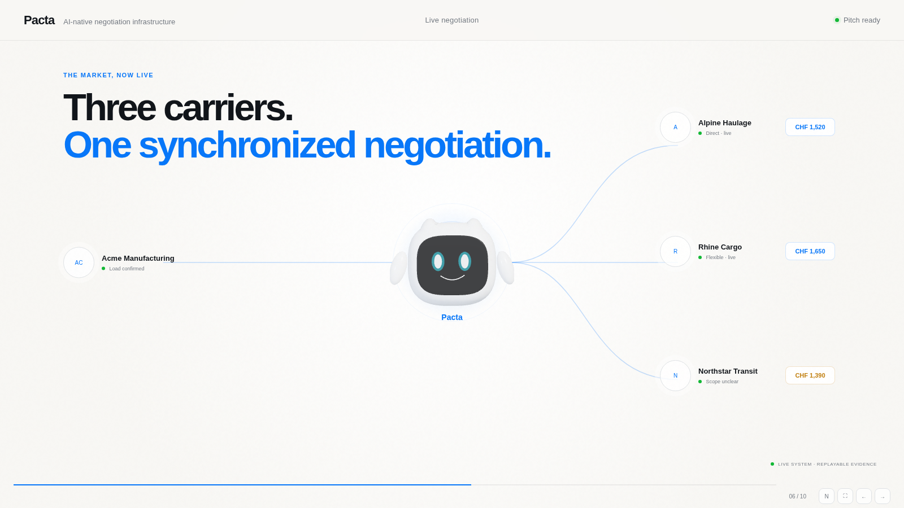
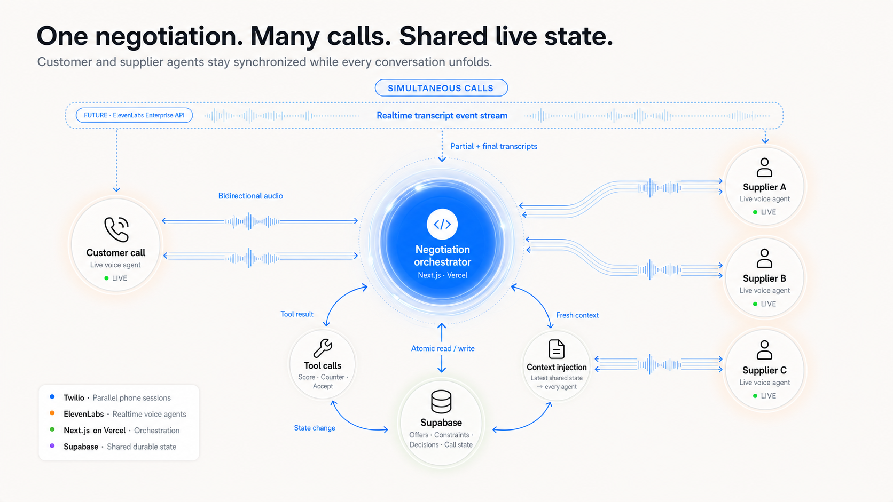

<p align="center">
  
</p>

<h1 align="center">Pacta</h1>

<p align="center"><strong>One request in. A live market out.</strong></p>

<p align="center">
  AI-native negotiation infrastructure that turns one confirmed customer request into parallel supplier conversations, comparable offers, verified leverage, and an explicit commitment.
</p>

<p align="center">
  <a href="https://pacta.openexp.dev">Live app</a> ·
  <a href="presentations/pacta-case-pitch/README.md">Pitch deck</a> ·
  <a href="docs/call-flow.md">System flow</a> ·
  <a href="docs/milestones/evidence/2026-07-19-implementation-checkpoint.md">Evidence checkpoint</a>
</p>



## What Pacta does

Most sourcing workflows repeat the same job over the phone, one supplier at a time. Pacta creates one shared negotiation instead:

1. **Confirm once.** The customer supplies structured requirements and explicitly confirms one immutable job revision.
2. **Call in parallel.** Independent ElevenLabs supplier agents receive the same confirmed facts and negotiate concurrently.
3. **Share verified leverage.** Typed tool calls commit comparable offers to shared state; each agent receives only evidence-backed updates it is allowed to use.
4. **Close deliberately.** The customer selects an offer, the chosen supplier confirms the exact terms, and every other conversation receives a terminal outcome.

The engine is configuration-driven. Freight brokerage is the primary demo, but job fields, offer schemas, negotiation policy, terminology, and recommendation rules live in versioned use-case configuration rather than the runtime.

## The coordination model

Pacta is not a group call and the agents do not message each other directly. Every conversation is independent. Short, authenticated tool calls read or mutate one authoritative negotiation state between speaking turns.



> **Target architecture.** The current MVP uses an ElevenLabs text chat for the customer and ElevenLabs-native outbound supplier calls. The diagram's customer voice call and dotted Enterprise realtime transcript stream are future-facing. Twilio represents the phone transport layer; the current application does not call Twilio's REST API directly.

### Current runtime contract

| Boundary      | What is true today                                                                                                                        |
| ------------- | ----------------------------------------------------------------------------------------------------------------------------------------- |
| Customer      | One ElevenLabs `text_chat` conversation for typed intake, PDF/image input, confirmation, review, and selection.                           |
| Suppliers     | One independent ElevenLabs voice conversation per supplier, launched in parallel only after the job is confirmed.                         |
| Orchestration | Short Next.js endpoints on Vercel validate milestones, return deterministic next actions, and never stay open for the duration of a call. |
| Shared state  | Supabase/PostgreSQL owns immutable revisions, ordered events, evidence, offers, comparisons, selection, and commitment state.             |
| Live context  | Supplier agents call `get_negotiation_state` at a natural or silence-triggered turn and receive only verified, comparable leverage.       |
| Telephony     | ElevenLabs owns call execution. Direct Twilio credentials are optional and unused by the native MVP path.                                 |
| Realtime UI   | Supabase Realtime projects committed events to the interface; it is not the source of truth.                                              |

“Realtime” currently means **tool-call and turn boundaries**. Pacta does not inject text mid-utterance, force an idle agent to speak, or treat raw transcript text as an authoritative offer.

## End-to-end flow

```text
Customer intake
      ↓ explicit confirmation
Immutable job revision
      ↓ parallel launch
Supplier A ─┐
Supplier B ─┼─→ typed milestones → shared negotiation state
Supplier C ─┘                         ↓
      ↑ verified leverage ← comparison + policy
      ↓
Customer selection → supplier commitment → closeout
```

The important boundaries are intentional:

- supplier outreach cannot start before explicit customer confirmation;
- every supplier receives the same immutable job revision;
- an offer becomes leverage only after server-side validation and comparability checks;
- customer selection authorizes a commitment attempt—it is not proof of supplier acceptance; and
- PostgreSQL remains authoritative even when webhooks retry or realtime packets arrive out of order.

The full lifecycle, failure paths, and event semantics live in [`docs/call-flow.md`](docs/call-flow.md).

## What is implemented

- Next.js 16 application with a mascot-centered live/replay session console
- Native ElevenLabs customer and supplier agents with typed milestone/state tools
- Parallel supplier conversation orchestration with a fail-closed telephony switch
- Config-driven job, offer, clarification, negotiation, and recommendation contracts
- Drizzle/PostgreSQL persistence with immutable revisions, ordered events, evidence, RLS, and private Supabase Storage
- Customer PDF/image intake with durable artifact hashing and private storage
- Idempotent webhook handling, post-call reconciliation, and explicit selection/commitment separation
- Unit, integration, build, and Playwright browser coverage

### Evidence status

| Verified                                                           | Still unproven or future-facing                           |
| ------------------------------------------------------------------ | --------------------------------------------------------- |
| Database migrations, RLS membership, and private artifact access   | Complete deployed customer file turn through the provider |
| Typed job, offer, state, selection, and commitment transitions     | Full safe customer-plus-three-supplier provider run       |
| Cross-session leverage between two active ElevenLabs conversations | One then three real outbound PSTN supplier calls          |
| Idempotent retries and fail-closed outbound calling                | Real-call behavior of `skip_turn` and `end_call`          |
| Production build, health/readiness, and disarmed deployment        | Enterprise realtime transcript event integration          |

The dated, sanitized proof record is [`docs/milestones/evidence/2026-07-19-implementation-checkpoint.md`](docs/milestones/evidence/2026-07-19-implementation-checkpoint.md). It contains no credentials, phone numbers, raw transcripts, or customer documents.

## Run locally

### Prerequisites

- Node.js 24
- pnpm 11.13.1
- PostgreSQL 17 or a Supabase project
- ElevenLabs credentials only when exercising provider-backed conversations

### Setup

```bash
pnpm install --frozen-lockfile
cp .env.example .env
```

Fill the required database and Supabase values in `.env`, then validate configuration and apply migrations:

```bash
pnpm config:check
pnpm db:migrate
pnpm dev
```

The web app starts at `http://localhost:3000` by default.

### Verify

```bash
pnpm lint
pnpm typecheck
pnpm test
pnpm build
pnpm test:e2e
```

### Telephony safety

Outbound calls are disabled unless this exact value is present:

```dotenv
PACTA_OUTBOUND_CALLS_ENABLED=true
```

Keep it unset or `false` during normal development. The safe E2E path uses the private supplier agent in `text_only` mode and creates no outbound call request:

```bash
pnpm e2e:safe
```

## Repository map

| Path                                                                 | Purpose                                                                    |
| -------------------------------------------------------------------- | -------------------------------------------------------------------------- |
| [`apps/web/`](apps/web/)                                             | Next.js product UI, API routes, orchestration, and provider webhooks       |
| [`packages/core/`](packages/core/)                                   | Domain reducer, comparison logic, events, and shared types                 |
| [`packages/db/`](packages/db/)                                       | Drizzle schema, migrations, persistence, and integration tests             |
| [`packages/elevenlabs/`](packages/elevenlabs/)                       | ElevenLabs contracts, client, runtime, SSE, and webhook handling           |
| [`packages/use-case-config/`](packages/use-case-config/)             | Versioned domain configuration compiler and fixtures                       |
| [`config/use-cases/`](config/use-cases/)                             | Freight and contractor configuration examples                              |
| [`docs/`](docs/)                                                     | Architecture, decisions, investigations, evidence, and implementation plan |
| [`experiments/`](experiments/)                                       | Narrow provider proofs with explicit pass/fail criteria                    |
| [`presentations/pacta-case-pitch/`](presentations/pacta-case-pitch/) | Standalone 3–5 minute pitch deck and generated visuals                     |
| [`mascot/`](mascot/)                                                 | Editable Blender character, web viewer, motion, audio, and renders         |
| [`resources/`](resources/)                                           | Original challenge artifacts, verbatim notes, and checksums                |

## Read next

- [`docs/call-flow.md`](docs/call-flow.md) — canonical product lifecycle and invariants
- [`docs/decisions/0002-native-elevenlabs-milestone-tools.md`](docs/decisions/0002-native-elevenlabs-milestone-tools.md) — accepted native agent/tool architecture
- [`docs/architecture/database-schema.md`](docs/architecture/database-schema.md) — authoritative state and persistence model
- [`docs/architecture/use-case-configuration.md`](docs/architecture/use-case-configuration.md) — domain-neutral configuration contract
- [`docs/implementation-plan.md`](docs/implementation-plan.md) — verified and pending milestones

## Pitch deck

```bash
python3 presentations/pacta-case-pitch/serve.py
```

Open `http://127.0.0.1:4173/`. The deck has ten slides, presenter notes (`N`), keyboard navigation, and an explicit evidence warning wherever an exchange is still illustrative.
