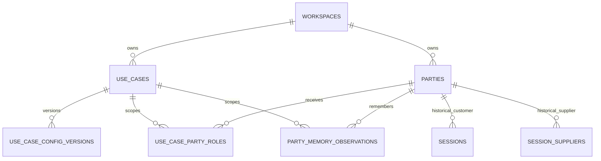

# Use-case CRM schema

Status: database foundation and evidence-backed conversation memory implemented; management UI deferred

## Outcome

The existing `parties` table is the workspace-level CRM identity record. The
new `use_case_party_roles` table assigns that identity a customer or supplier
role for one stable use case.

This supports the required combinations without duplicating contacts:

| Party | Freight         | Moving            |
| ----- | --------------- | ----------------- |
| X     | customer        | inactive supplier |
| Y     | supplier        | customer          |
| Z     | no relationship | supplier          |

The relationship points to `use_cases`, not `use_case_config_versions`.
Published config versions are immutable executable policy; CRM rosters are
mutable operating data. A new freight config version therefore continues to
see the freight roster, while historical sessions remain pinned to the exact
config version and party IDs they used.

## Tables and ownership

### `parties`

One durable CRM identity per workspace. Existing columns already cover display
name, phone, timezone, locale, external-system references, and extensible
attributes. `role_keys` remains in place for compatibility with the current
session bootstrap; new management code should treat `use_case_party_roles` as
the source of truth for use-case membership.

### `use_case_party_roles`

- `workspace_id`: explicit tenant boundary for querying and future RLS;
- `use_case_id`: stable domain scope such as freight or moving;
- `party_id`: the reusable CRM identity;
- `role_key`: `customer` or `supplier`;
- `status`: `active` or `inactive` for recoverable removal;
- `relationship_data jsonb`: use-case-specific CRM metadata such as internal
  notes, account owner, service region, or configured qualification fields;
- timestamps maintained by the standard update trigger.

The unique key `(use_case_id, party_id, role_key)` prevents duplicate roster
entries. A database trigger rejects cross-workspace relationships. Foreign keys
do not cascade, so removing mutable CRM membership cannot erase historical
sessions.

## Compatibility with the current root flow

The root page continues accepting ad-hoc phone numbers and creating
session-local party rows exactly as before. The session endpoint additionally
accepts a CRM `partyId`; that path requires an active customer/supplier role for
the selected use case and reuses the durable party ID. Requiring CRM selection
would break the demo flow, so the future picker remains optional.

## Conversation memory

`party_memory_observations` stores immutable facts learned through the
`store_party_memory` ElevenLabs tool. The server verifies that the exact
evidence quote occurs in the latest supplier turn, derives party, workspace,
and use case from the provider conversation, authenticates the expiring
conversation capability supplied through an ElevenLabs dynamic tool field,
deduplicates retries, and links a correction to the prior observation with the
same stable key. Only the capability hash is stored.

Before a later call or supplier preview starts, Pacta selects the newest
observation for each key, limits the result to eight facts, and passes the JSON
through ElevenLabs' `party_memory` dynamic variable. Supplier prompts delimit
it as untrusted historical context; memory cannot override instructions or
become current quote truth.

## Build plan after this database foundation

1. Add authenticated workspace-scoped CRM endpoints. Keep party identity edits
   separate from role membership edits.
2. Build a management screen with use-case, role, status, and evidence-backed
   memory filters. Editing
   `relationship_data` should be driven by validated CRM field definitions,
   not an unrestricted JSON editor.
3. Add an optional CRM picker to the root page using the already-supported
   `partyId` session input while preserving the ad-hoc contact path.
4. Backfill role rows for useful existing parties only after a deterministic
   deduplication rule exists. Do not infer identity from phone number alone
   without an operator-reviewed collision policy.
5. Before enabling RLS again, add workspace-member policies for the CRM and
   memory tables and test reads and writes as anonymous, authenticated, and
   service roles.

## Deliberate non-decisions

- Organizations versus individual contacts are not split yet; the existing
  product has no proven multi-contact requirement.
- Config-version-specific allowlists are not modeled. If a future published
  config must freeze an eligible roster, add a separate immutable snapshot
  table rather than changing this mutable CRM relationship.
- `relationship_data` has no domain schema yet. Its future validator must be
  sourced from a separately versioned CRM-fields contract; silently trusting
  arbitrary JSON would move correctness out of the database without replacing
  it elsewhere.
- Derived behavioral summaries and memory snapshots are deferred. The current
  prompt context contains only bounded, directly evidenced observations.
