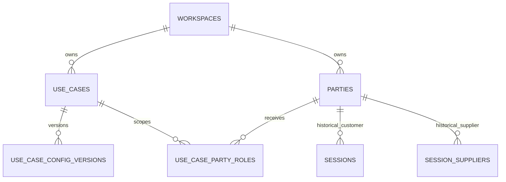

# Use-case CRM schema

Status: database foundation implemented; management API and UI intentionally deferred

## Outcome

The existing `parties` table is the workspace-level CRM identity record. The
new `use_case_party_roles` table assigns that identity a customer or supplier
role for one stable use case.

This supports the required combinations without duplicating contacts:

| Party | Freight         | Moving            |
| ----- | --------------- | ----------------- |
| X     | customer        | inactive supplier |
| Y     | supplier        | customer          |
| Z     | no relationship | supplier          |

The relationship points to `use_cases`, not `use_case_config_versions`.
Published config versions are immutable executable policy; CRM rosters are
mutable operating data. A new freight config version therefore continues to
see the freight roster, while historical sessions remain pinned to the exact
config version and party IDs they used.

## Tables and ownership

### `parties`

One durable CRM identity per workspace. Existing columns already cover display
name, phone, timezone, locale, external-system references, and extensible
attributes. `role_keys` remains in place for compatibility with the current
session bootstrap; new management code should treat `use_case_party_roles` as
the source of truth for use-case membership.

### `use_case_party_roles`

- `workspace_id`: explicit tenant boundary for querying and future RLS;
- `use_case_id`: stable domain scope such as freight or moving;
- `party_id`: the reusable CRM identity;
- `role_key`: `customer` or `supplier`;
- `status`: `active` or `inactive` for recoverable removal;
- `relationship_data jsonb`: use-case-specific CRM metadata such as internal
  notes, account owner, service region, or configured qualification fields;
- timestamps maintained by the standard update trigger.

The unique key `(use_case_id, party_id, role_key)` prevents duplicate roster
entries. A database trigger rejects cross-workspace relationships. Foreign keys
do not cascade, so removing mutable CRM membership cannot erase historical
sessions.

## Compatibility with the current root flow

This migration is additive. It does not change `sessions`, `session_suppliers`,
the session creation endpoint, or `/`. The root page may continue accepting
ad-hoc phone numbers and creating session-local party rows exactly as before.
Requiring CRM selection now would break that flow, so roster enforcement is
explicitly deferred until the management UI and session picker are shipped
together.

## Build plan after this database foundation

1. Add repository functions to list active parties by use case and role, create
   or update a party, assign a role, and mark a role inactive.
2. Add authenticated workspace-scoped CRM endpoints. Keep party identity edits
   separate from role membership edits.
3. Build a management screen with use-case, role, and status filters. Editing
   `relationship_data` should be driven by validated CRM field definitions,
   not an unrestricted JSON editor.
4. Add an optional CRM picker to session creation while preserving an
   “ad-hoc contact” path. The selected IDs must be copied into `sessions` and
   `session_suppliers` so later CRM edits cannot rewrite session history.
5. Backfill role rows for useful existing parties only after a deterministic
   deduplication rule exists. Do not infer identity from phone number alone
   without an operator-reviewed collision policy.
6. Before enabling RLS again, add workspace-member policies for the new table
   and test reads and writes as anonymous, authenticated, and service roles.

## Deliberate non-decisions

- Organizations versus individual contacts are not split yet; the existing
  product has no proven multi-contact requirement.
- Config-version-specific allowlists are not modeled. If a future published
  config must freeze an eligible roster, add a separate immutable snapshot
  table rather than changing this mutable CRM relationship.
- `relationship_data` has no domain schema yet. Its future validator must be
  sourced from a separately versioned CRM-fields contract; silently trusting
  arbitrary JSON would move correctness out of the database without replacing
  it elsewhere.
