# Custom LLM live-call runtime research

> Historical design note: this research compared the original long-lived customer-PSTN option. The implemented MVP now uses ElevenLabs text chat for the customer and PSTN only for suppliers. Where this document discusses a customer silence timeout or reserved voice slot, [`../call-flow.md`](../call-flow.md) and ADR 0001 contain the superseding contract.

Status: researched architecture proposal; protocol behavior still requires a live spike

Checked against primary documentation on 2026-07-19.

## Conclusion

An ElevenLabs Custom LLM endpoint is feasible and is the best first implementation for this product.

It lets us keep ElevenLabs responsible for telephony integration, speech recognition, turn detection, text-to-speech, and interruption handling while every model decision passes through our server. On each completed user speech turn, our server can persist the new transcript, derive structured negotiation state, load the newest facts from every parallel negotiation, and stream the next response back to ElevenLabs.

This removes the need for the ElevenLabs agent to call our tools merely to report observations such as:

- “the carrier quoted $1,700 all-in”;
- “fuel is excluded”;
- “pickup cannot happen before 15:00”;
- “the carrier declined”;
- “they asked for a callback.”

It does **not** remove all tools or explicit commands. Irreversible actions—ending or transferring a call, sending a message, accepting an award, booking, paying, or making a binding commitment—still need deterministic authorization and confirmation gates.

The principal uncertainty is idempotency. The documented HTTP request has accumulated `messages` and supports our extra body data, but it does not document a conversation ID or per-turn event ID. We can resolve a scoped brain token to our call and fingerprint message history, but retries, corrected transcripts, and interruptions must be tested. If that contract is insufficient, ElevenLabs Speech Engine is the stronger-control alternative because its WebSocket protocol explicitly supplies `conversation_id` and `event_id`.

## What this repository has already proved

Two local experiments narrow the problem:

- [`../../experiments/elevenlabs/realtime-monitoring/results/2026-07-19.md`](../../experiments/elevenlabs/realtime-monitoring/results/2026-07-19.md) records ElevenLabs rejecting monitoring enablement on this workspace with `monitoring_enterprise_only`. The architecture must not depend on enterprise contextual-update sockets.
- [`../../experiments/elevenlabs/shared-state-negotiation/results/2026-07-19.md`](../../experiments/elevenlabs/shared-state-negotiation/results/2026-07-19.md) proves two simultaneous ElevenLabs conversations can exchange verified offers at turn boundaries through shared server state without monitoring. Its remaining weakness is that reporting/sync tool use is model-mediated.

The Custom LLM endpoint is the direct next experiment: it preserves the successful turn-boundary shared-state behavior while moving transcript capture and state reduction from optional speaking-model tool choices into server-controlled code.

Confidence:

- high that the HTTP Custom LLM architecture is supported;
- high that it provides finalized-turn transcript access without enterprise monitoring;
- medium that transcript fingerprinting is sufficient for production idempotency until tested;
- medium that Speech Engine's newer telephony path is mature enough for immediate production use;
- medium that Vercel's current WebSocket public beta meets the socket bridge's reliability needs without a separate host.

## Two different ElevenLabs products called “custom”

The product choice is easier if these are treated as separate protocols.

| Capability                                      | ElevenAgents HTTP Custom LLM              | ElevenLabs Speech Engine             |
| ----------------------------------------------- | ----------------------------------------- | ------------------------------------ |
| Our server interface                            | OpenAI-compatible HTTP POST               | ElevenLabs connects to our WebSocket |
| Request moment                                  | Once ElevenLabs needs the next model turn | Each finalized user speech turn      |
| Transcript                                      | Accumulated `messages`                    | Full conversation history            |
| Documented conversation ID in brain request     | No                                        | Yes, `conversation_id` on `init`     |
| Documented turn/interrupt ID                    | No                                        | Yes, monotonic `event_id`            |
| Response                                        | OpenAI-compatible SSE                     | `agent_response` WebSocket chunks    |
| Native ElevenAgents Twilio outbound API         | Yes                                       | No; own Twilio Media Streams bridge  |
| ElevenLabs owns ASR/turn-taking/TTS             | Yes                                       | Yes                                  |
| We own LLM, context, and internal state reducer | Yes                                       | Yes                                  |
| Implementation burden                           | Lower                                     | Higher                               |

The recommendation is not “choose the most flexible protocol immediately.” It is:

1. prove the product loop through HTTP Custom LLM;
2. measure the protocol gaps rather than assuming them;
3. move only the call runtime to Speech Engine if exact turn IDs, proactive speech, or deeper interruption control becomes necessary.

The database and reducer below are transport-independent, so this is not a rewrite of the business system.

## What “live transcription” means here

The HTTP Custom LLM documentation shows ElevenLabs sending the accumulated message list, including prior assistant/user messages, when requesting the next response. That is enough to detect and publish each new **finalized user turn** as it reaches our endpoint.

Speech Engine makes the timing explicit: it sends `user_transcript` “each time the user finishes a speech turn,” with full history and an `event_id`.

Therefore:

- the dashboard can update after each completed utterance;
- negotiation state can update without an agent-chosen webhook tool call;
- the post-call transcript remains useful for reconciliation;
- neither brain protocol documents word-by-word partial captions while the person is still speaking.

If the UI genuinely needs captions that change during an utterance, add an audio fork plus ElevenLabs Scribe v2 Realtime (which has `partial_transcript` and `committed_transcript` events), or another real-time STT service. Do not add this initially: transient partial text is noisy evidence and is unnecessary for negotiation-state updates.

There is another boundary: an HTTP Custom LLM endpoint is reactive. It is called when ElevenLabs wants an agent response. If a competing quote arrives while another supplier is speaking, the next model turn can use it. For the required long-lived customer call, the MVP configures ElevenLabs' 1–30 second `turn_timeout` and treats silence-triggered turns as a bounded polling clock: each turn reads session events newer than the call's last delivered sequence and reports material changes. When nothing changed, the custom LLM returns the documented `skip_turn` system tool so the line remains silent. This is not exact server-pushed interruption, and repeated silence/skip cycles on a real PSTN call are a P0 experiment. If that experiment fails, the HTTP-only runtime does not meet the agreed flow.

## Recommended MVP architecture

```mermaid
flowchart LR
    PHONE["Customer or supplier phone"]
    EL["ElevenAgents<br/>Twilio + ASR + turn-taking + TTS"]
    BRAIN["POST /v1/chat/completions<br/>our custom brain"]
    REDUCER["Turn reducer<br/>schema-validated observations"]
    PG["PostgreSQL<br/>Drizzle + event log"]
    CONTEXT["Context builder<br/>job + memory + latest leverage"]
    MODEL["Streaming response model"]
    RT["Supabase Broadcast / UI"]

    PHONE <-->|audio| EL
    EL -->|accumulated messages + our IDs| BRAIN
    BRAIN --> REDUCER
    REDUCER -->|transaction| PG
    PG --> CONTEXT
    CONTEXT --> MODEL
    MODEL -->|OpenAI-compatible SSE| EL
    PG -->|committed session events| RT
    MODEL -->|assistant text chunks| RT
```



The custom brain should be one thin, transport-facing adapter around domain services. It must not become a second unversioned prompt monolith.

### Call initiation

Before dialing, create our `conversations` row, its negotiation/session relationships, and scoped opaque token. Originate the call through ElevenLabs' native Twilio outbound endpoint using the already imported number. The successful response returns both `conversation_id` and `callSid`. The personalization contract permits `custom_llm_extra_body`; ElevenLabs exposes that to the HTTP endpoint as `elevenlabs_extra_body`.

Conceptual initiation data:

```json
{
  "custom_llm_extra_body": {
    "brain_token": "opaque-high-entropy-token",
    "brain_contract_version": 1
  },
  "user_id": "application-call-id-for-post-call-correlation"
}
```

The brain token resolves to the call, session, negotiation, config, and tenant; store only its hash. The endpoint must also authenticate the provider credential configured for the Custom LLM integration, reject unknown calls, verify tenant ownership through the database, and never accept a workspace ID from the body as authority. The `user_id` is correlation for reconciliation, not authorization.

Save both provider identifiers from the native outbound response. If the request outcome is ambiguous, mark initiation unknown and reconcile against ElevenLabs conversation records before any retry; never assume a timeout means no call was placed.

### One HTTP brain request

ElevenLabs calls our OpenAI-compatible endpoint with `stream: true`, accumulated messages, model settings, optional tools, and `elevenlabs_extra_body`. The response must be SSE with OpenAI-compatible chunks and a terminal `[DONE]` record.

The internal flow is:

```text
authenticate
  → resolve call/session/config
  → canonicalize message history
  → claim idempotent turn execution
  → persist the newest finalized user turn
  → reduce and transactionally commit business observations
  → load compact state and newest cross-negotiation leverage
  → stream the next model response
  → persist final assistant turn or mark generation aborted
```

Only the work needed for the current response belongs on this latency-sensitive path. Memory summarization, analytics, embeddings, post-call reconciliation, and supplier-profile rebuilding run from post-call/operator actions outside response generation. A workflow engine is not required for the MVP.

## Structured turn reducer

The reducer is an internal model call controlled by our server. It is not an ElevenLabs webhook tool and it does not speak to the caller.

Inputs:

- the newly finalized user utterance;
- its immediately relevant transcript context;
- current job/offer/negotiation projections;
- pinned job and offer JSON Schemas;
- allowed observation, phase, outcome, and line-item keys from config.

Output example:

```json
{
  "observations": [
    {
      "type": "offer.price_stated",
      "payload": {
        "amountMinor": 170000,
        "currency": "USD",
        "basis": "all_in"
      },
      "confidence": 0.98,
      "evidenceTurnId": "018f..."
    }
  ],
  "phaseTransition": {
    "to": "clarifying_terms",
    "reason": "A price was stated but inclusions remain unknown"
  },
  "clarificationNeeds": ["Confirm whether fuel and accessorials are included"]
}
```

Then application code—not the model—must:

1. validate the JSON shape;
2. validate configured type keys and state transitions;
3. validate the proposed job/offer document against the pinned JSON Schema;
4. attach exact transcript evidence;
5. create immutable revisions and update projections in one transaction;
6. derive shareable leverage only from a stored, comparable offer revision;
7. append ordered `session_events` and pending context-delivery records.

The reducer should return an empty observation set when nothing commercially relevant changed. It must never be forced to invent an update per turn.

### Observation versus commitment

Use three semantic levels:

```text
observed → verbally_confirmed → externally_committed
```

- `observed`: extracted from speech with evidence; safe to display as “stated.”
- `verbally_confirmed`: the agent read back exact terms and the person explicitly affirmed them.
- `externally_committed`: a deterministic booking/award action succeeded and its provider confirmation was persisted.

This prevents an uncertain transcript such as “I could maybe do seventeen” from becoming a binding $1,700 award.

## Response context and cross-call injection

Immediately before response generation, build a compact context document from committed records:

```json
{
  "call": { "purpose": "supplier_negotiation" },
  "job": { "confirmedRevision": {} },
  "counterparty": { "facts": {}, "memory": {} },
  "negotiation": { "phase": "bargaining", "currentOffer": {} },
  "marketLeverage": [
    {
      "factId": "018f...",
      "statement": "A comparable carrier offered USD 1,500 all-in",
      "shareability": "amount_without_identity",
      "validUntil": "2026-07-19T18:00:00Z"
    }
  ],
  "requiredClarifications": [],
  "allowedActions": ["ask_clarification", "counter", "end_call"]
}
```

Every parallel call reads the latest committed facts at the start of its next model turn. No process-local mutable conversation object is authoritative. A quote that commits during supplier A's call becomes available to supplier B on B's next response even when their calls are handled by different server instances.

Record the highest `session_events.event_seq` included in each `conversation_turn_execution.context_event_seq`. Record individual high-value injections in `context_injections`. This gives us an audit answer to: “Did the model know about the $1,500 quote when it said this?”

Do not inject entire other-call transcripts. Inject verified facts with provenance and sharing rules. This is smaller, safer, and makes false competitive claims testable.

## Idempotency and interruption handling

### HTTP Custom LLM adapter

The public HTTP contract does not currently show a per-turn event ID. The provisional idempotency key is:

```text
SHA-256(
  brain_contract_version
  + conversation_id
  + canonicalized accumulated messages
)
```

Canonicalization must be deterministic: normalize the supported message structure, preserve role/content order, remove fields known to be transport noise, and serialize with stable key ordering. Do not hash only the last sentence; repeated caller utterances are legitimate.

Insert `conversation_turn_executions` under a unique `(provider, conversation_id, input_fingerprint)` constraint. A duplicate request returns/replays the stored result when complete or joins the active execution when possible. The live spike must determine whether ElevenLabs retries a disconnected SSE request and whether it sends corrected history after barge-in.

This is the largest unresolved risk in the HTTP design.

### Speech Engine adapter

Speech Engine has the cleaner contract:

- `init` supplies `conversation_id`;
- every `user_transcript` supplies `event_id` and full history;
- a higher event ID means the user interrupted;
- our server cancels the old model request;
- ElevenLabs discards response chunks carrying the obsolete event ID.

The unique key becomes `(conversation_id, event_id)`, with no inferred fingerprint needed for primary idempotency.

For both adapters, a finalized user observation may commit even if the assistant response is later interrupted. An aborted assistant response must not be stored as a final transcript turn or treated as a promise the caller heard.

## What tools remain

Remove ElevenLabs webhook tools whose only purpose is to mirror conversational facts into our database. The reducer sees every finalized turn and is more reliable than hoping the speaking model remembers to call a reporting tool.

Keep explicit tools/commands for:

- ending, transferring, or otherwise controlling the call;
- sending email/SMS or requesting a document;
- selecting or confirming an offer;
- committing an award or booking;
- payments and other external side effects;
- operator actions;
- any action whose authorization cannot be inferred from transcript observation alone.

In HTTP Custom LLM mode, ElevenLabs documents its built-in system tools in the request's `tools` field and accepts standard OpenAI function-call responses. Our own business commands can run inside the brain service, but they must still use idempotency keys, authorization checks, and transactional state/event writes.

## Speech Engine alternative

Move to Speech Engine when one or more tested requirements fail on the HTTP path:

- exact provider event identity is required;
- HTTP retry/correction behavior cannot be made safe;
- proactive server-initiated agent speech is required and verified through the SDK;
- we need direct control over aborting and replacing in-flight model generations;
- a provider-independent “brain socket” is strategically worth owning.

For phone calls, the official ElevenLabs guide uses a three-route bridge:

- `POST /incoming-call` returns TwiML containing `<Connect><Stream>`;
- `GET /media-stream` relays Twilio μ-law audio to and from the ElevenLabs conversation socket;
- `GET /ws` is the brain socket to which ElevenLabs connects.

The guide demonstrates inbound calling. Outbound is a supported Twilio composition: create a Call through Twilio's Calls API and point its URL at a route returning the same `<Connect><Stream>` TwiML. Twilio explicitly documents bidirectional Media Streams for real-time AI conversation and outbound contact-center use cases. This outbound conclusion combines the two official contracts; ElevenLabs does not currently provide the same single outbound convenience endpoint for Speech Engine in the cited guide.

Security requirements:

- validate Twilio's `X-Twilio-Signature` before returning TwiML/upgrading its stream;
- validate `X-Elevenlabs-Speech-Engine-Authorization`, including JWT signature, issuer, subject, and expiry, on the brain socket;
- use a separate shared secret for any configured request header;
- never expose raw API keys to the browser or Twilio stream;
- correlate provider IDs only to server-created call rows.

## Deployment

### HTTP-first MVP

The HTTP brain can run as a streaming Vercel Function. It does not require us to host a WebSocket. Recommended services:

- Vercel: Next.js UI, outbound-call API, OpenAI-compatible Custom LLM endpoint;
- PostgreSQL/Supabase: Drizzle schema, authoritative state and replayable event log;
- Supabase Broadcast: private dashboard fan-out after database commit;
- idempotent Next.js route handlers/server actions: operator-visible call launch, retries, and reconciliation without a separate workflow engine;
- object storage: recordings and provider artifacts.

The SSE request should complete within seconds, so it is a normal latency-sensitive request—not a durable workflow. Never enqueue response generation behind a job queue.

### Speech Engine path

As of 2026-07-19, Vercel says WebSocket support and Vercel Services are in public beta. A connection is pinned to one Function instance, so cross-call/shared state cannot live only in memory. PostgreSQL remains authoritative; Redis or database-backed Broadcast handles cross-instance ephemeral fan-out.

This makes an all-Vercel bridge technically plausible. Because WebSocket support is recent and calls are long-lived, run a concurrency and connection-duration test before committing. The conservative fallback is Vercel for UI/API plus one small container service on Railway, Fly.io, or Render for `/media-stream` and `/ws`; no database redesign is required.

## Latency budget

The critical path is:

```text
end of speech
  → ElevenLabs turn detection/transcription
  → our endpoint
  → transcript write + fast reducer + DB commit
  → context load
  → response model first tokens
  → ElevenLabs TTS first audio
```

The reducer adds a second model operation unless response generation and extraction are combined. Initially keep them separate because state correctness is easier to validate. Keep the reducer prompt tiny, use a low-latency model, run independent context reads in parallel, and instrument every boundary in `conversation_turn_executions.timings`.

An engineering target—not a provider guarantee—is under 1.5 seconds from end of speech to first returned model text, then measure end-of-speech to first audible speech separately. If the reducer makes the call feel slow, evaluate a single-model structured preamble or speculative response generation only after correctness tests exist.

## Cost and concurrency

Provider pricing, concurrent-call entitlement, and outbound dial rate are dynamic account constraints, not architectural guarantees. Check the actual ElevenLabs account before every load test. The current Free/PAYG plan advertises four voice calls, so the agreed long-lived flow fits one customer plus three suppliers. Five suppliers plus the customer needs six slots. The session state machine must reserve the customer slot and treat planned, dialing, connected, terminal, and initiation-unknown states separately; the native API does not justify an exact `ringing`/`answered` distinction in the UI.

## Proof-of-feasibility build

Build one thin end-to-end use-case slice before implementing the full negotiation engine.

### HTTP Custom LLM spike

1. Configure one ElevenAgents agent to call a protected `/v1/chat/completions` endpoint.
2. Create one `conversations` row, place one native ElevenLabs outbound call, store its `conversation_id` and `callSid`, and pass a scoped brain token through `custom_llm_extra_body`.
3. Persist each newly finalized user turn once and stream it to the UI.
4. Reduce a spoken freight quote into a schema-valid immutable offer revision with transcript evidence.
5. Insert a competing quote directly into the same session between turns and prove the next agent response sees it without an ElevenLabs webhook tool.
6. Force client disconnect/retry and barge-in cases; inspect request bodies and prove no duplicate offer revision is created.
7. Reconcile against the post-call transcript and record any differences.
8. Measure end-of-speech → endpoint arrival → state commit → first SSE token → first audio.
9. Keep one customer PSTN call open, commit a supplier event while the customer is silent, and prove a 20–30 second silence-triggered turn announces the update without customer speech. Prove that later silence turns continue and do not repeat already delivered facts.

Pass conditions:

- stable call correlation is present on every request;
- a user turn appears once in business state despite retries;
- latest committed cross-call context appears on the next supplier turn and on a bounded silence-triggered customer turn;
- interrupted assistant output is not persisted as a completed promise;
- quote values always cite the source turn and validate against pinned config;
- conversational latency is acceptable in real phone audio.

### Decision gate

Keep the HTTP path if all pass conditions hold. Move the runtime spike to Speech Engine if correlation/idempotency, interruption behavior, or reactive-only turn scheduling blocks the product. Do not migrate merely because the WebSocket protocol appears more architecturally pure.

After the one-call spike passes, test one customer plus three concurrent supplier calls and verify event ordering, database contention, UI replay, and cross-call leverage propagation.

## Primary sources

- ElevenLabs Custom LLM request/response contract: <https://elevenlabs.io/docs/eleven-agents/customization/llm/custom-llm>
- ElevenLabs personalization and `custom_llm_extra_body`: <https://elevenlabs.io/docs/eleven-agents/customization/personalization>
- ElevenLabs native Twilio outbound call: <https://elevenlabs.io/docs/eleven-agents/api-reference/twilio/outbound-call>
- ElevenLabs conversation flow and silence timeout: <https://elevenlabs.io/docs/eleven-agents/customization/conversation-flow>
- ElevenLabs skip-turn system tool: <https://elevenlabs.io/docs/eleven-agents/customization/tools/system-tools/skip-turn>
- ElevenLabs Speech Engine overview: <https://elevenlabs.io/docs/overview/capabilities/speech-engine>
- ElevenLabs Speech Engine quickstart: <https://elevenlabs.io/docs/eleven-api/guides/cookbooks/speech-engine>
- ElevenLabs Speech Engine upstream WebSocket protocol: <https://elevenlabs.io/docs/api-reference/speech-engine/speech-engine-upstream>
- ElevenLabs Speech Engine/Twilio bridge guide: <https://elevenlabs.io/docs/eleven-agents/phone-numbers/twilio-integration/custom-llm-integration>
- ElevenLabs real-time monitoring and contextual update (enterprise-only): <https://elevenlabs.io/docs/eleven-agents/guides/realtime-monitoring>
- ElevenLabs real-time STT event reference: <https://elevenlabs.io/docs/eleven-api/guides/how-to/speech-to-text/realtime/event-reference>
- ElevenLabs API pricing: <https://elevenlabs.io/pricing/api>
- Twilio Calls resource: <https://www.twilio.com/docs/voice/api/call-resource>
- Twilio Media Streams: <https://www.twilio.com/docs/voice/media-streams>
- Vercel WebSocket public beta announcement: <https://vercel.com/changelog/websocket-support-is-now-in-public-beta>
- Vercel Services and WebSockets: <https://vercel.com/blog/vercel-services-run-full-stack-on-vercel>
- Vercel cross-instance WebSocket state: <https://vercel.com/kb/guide/real-time-chat-websockets>
