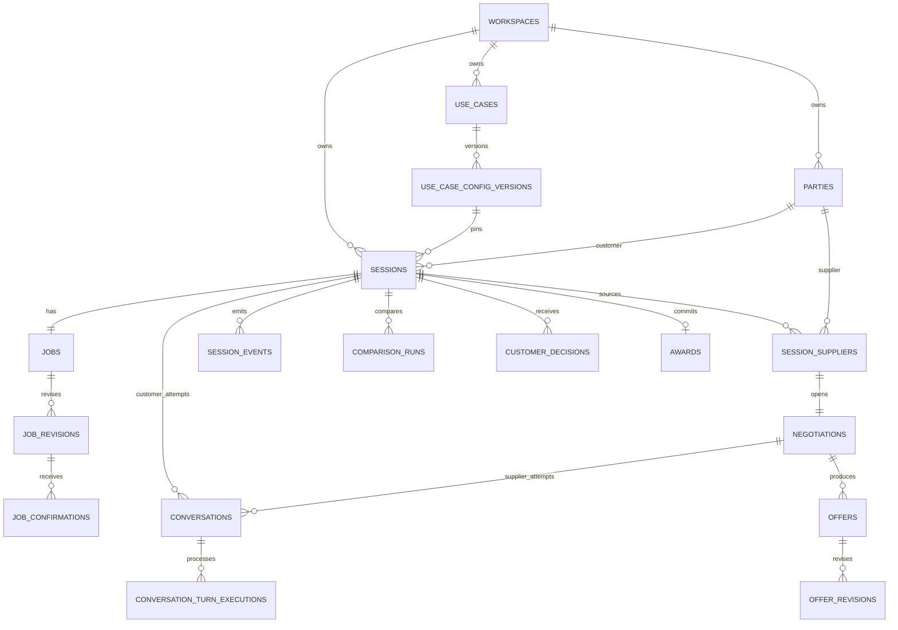

# Database architecture

Status: implemented in Drizzle migrations; provider behavior still has explicit proof gates

Scope: reusable intake → parallel supplier negotiation → customer selection → supplier commitment
Primary implementation target: PostgreSQL + Drizzle

## Decision summary

Use a hybrid relational/document model:

- PostgreSQL columns and foreign keys hold the universal mechanics: tenancy, identity, ownership, lifecycle, ordering, idempotency, and relationships.
- Versioned `jsonb` documents hold use-case-specific job, offer, rule, and metric data.
- JSON Schema 2020-12 definitions live in source-controlled use-case config files. Every session pins an immutable database snapshot of the exact config version it used.
- An append-only `session_events` table is the durable timeline and replay cursor for the UI. Current-state tables are transactional projections, not the only history.
- A negotiation is a commercial thread; a conversation is one voice or chat interaction attempt. One negotiation may use several conversation attempts because calls can fail, reach voicemail, disconnect, or require recovery.
- Supplier memory is deferred. The core offer, negotiation, disposition, and evidence history remains sufficient to add evidence-backed memory later without changing session semantics.

Do not put the entire application into one generic `entities` table. Configurability is needed for domain payloads, not for stable system concepts such as conversations, sessions, offers, and events.

## First-principles boundaries

### Stable relational mechanics

These concepts exist in every target use case and deserve typed tables:

- a tenant/workspace;
- a versioned use-case configuration;
- a party we communicate with;
- a session containing one customer request;
- the customer's structured job and its revisions;
- suppliers considered for that session;
- a negotiation with each supplier;
- one or more voice/chat conversation attempts in a customer session or supplier negotiation;
- evolving offers;
- a customer decision and a supplier commitment;
- artifacts, evidence, tool calls, events, and outbound side effects.

### Configurable documents

These vary materially by use case and belong in validated `jsonb`:

- job fields and their required/optional status;
- offer fields, line-item taxonomy, terms, and conditions;
- negotiation phase keys, terminal outcome keys, and transition rules;
- comparison metrics, ranking weights, red-flag rules, and negotiation levers;
- UI terminology, labels, icons, colors, and field presentation.

### Append-only facts versus replaceable projections

The system needs both:

- Immutable facts: config releases, job revisions, offer revisions, evidence, tool invocations, events, and context injections.
- Mutable projections: current session status, current negotiation phase, current job revision pointer, and current offer revision pointer.

A projection may be rebuilt from immutable facts. An immutable fact must never be silently rewritten to make the current UI look correct.

## Naming model

Use stable internal names and configure user-facing terminology.

| Stable internal concept | Freight brokerage label | Possible other use-case label  |
| ----------------------- | ----------------------- | ------------------------------ |
| customer                | shipper                 | patient, homeowner, buyer      |
| supplier                | carrier                 | provider, contractor, dealer   |
| job                     | load                    | procedure, scope, vehicle      |
| offer                   | carrier quote           | estimate, bid, price proposal  |
| session                 | load sourcing session   | case, request, procurement run |

Renaming database tables per use case would make shared code and migrations brittle. Only labels and payload schemas should vary.

## Use-case configuration contract

The canonical file should live at a path such as:

```text
config/use-cases/freight-brokerage/0.1.0.json
```

The deployment process validates the file, computes its SHA-256 digest, and inserts it into `use_case_config_versions`. Published rows are immutable. A session stores that row's ID, so a later config edit cannot reinterpret historical data.

Proposed top-level shape:

```json
{
  "$schema": "../../../packages/use-case-config/use-case-config.schema.json",
  "contractVersion": "1",
  "key": "freight_brokerage",
  "version": "0.1.0",
  "terminology": {
    "customerSingular": "shipper",
    "supplierSingular": "carrier",
    "jobSingular": "load",
    "offerSingular": "quote"
  },
  "job": {
    "schema": {},
    "intake": {},
    "presentation": {}
  },
  "offer": {
    "schema": {},
    "comparison": {},
    "presentation": {}
  },
  "negotiation": {
    "phases": [],
    "outcomes": [],
    "transitions": [],
    "levers": [],
    "honestyRules": []
  },
  "recommendation": {},
  "presentation": {}
}
```

Configuration is executable policy, so it must be versioned and tested like code. Unknown keys should fail validation by default rather than being silently ignored.

This database document intentionally does not own the domain contract. The complete proposed shape—including job questions, document hints, offer line items, clarification predicates, normalizers, recommendation rules, and anti-features—is in [`use-case-configuration.md`](use-case-configuration.md). The freight job and offer below are examples only; the same meta-schema must compile a structurally different non-freight fixture without engine code changes.

### Freight job document, first draft

Required for a quoteable truckload-style job:

- origin and destination;
- pickup window and delivery window or service expectation;
- equipment type;
- commodity description;
- weight and handling-unit count;
- explicit declaration of hazardous-material status;
- explicit special-service requirements, even when the answer is “none.”

Likely optional fields:

- dimensions, pallet count, stackability, temperature range, declared value;
- appointment requirements and facility hours;
- dock, liftgate, residential, inside-delivery, driver-assist, tarping, and customs needs;
- customer reference numbers, target budget, insurance minimum, and payment terms.

The word “explicit” matters. Missing, `null`, `false`, and an empty list are not equivalent. JSON Schema should define the meaning of each one. In particular, `hazmat: false` is known information while an absent `hazmat` field is incomplete intake.

### Freight offer document, first draft

```json
{
  "pricing": {
    "currency": "USD",
    "lineItems": [
      {
        "code": "linehaul",
        "label": "Linehaul",
        "amountMinor": 145000,
        "basis": "flat"
      },
      {
        "code": "fuel_surcharge",
        "label": "Fuel surcharge",
        "amountMinor": 12000,
        "basis": "flat"
      }
    ],
    "allInTotalMinor": 157000
  },
  "service": {
    "pickupCommitment": "2026-07-21T13:00:00Z",
    "deliveryCommitment": "2026-07-22T16:00:00Z",
    "equipmentType": "dry_van_53"
  },
  "terms": {
    "quoteType": "firm",
    "validUntil": "2026-07-20T18:00:00Z",
    "paymentTerms": "net_30"
  },
  "conditions": [],
  "exclusions": [],
  "unknowns": []
}
```

Money uses integer minor units plus an ISO currency code; never JSON floating-point values. Configured line-item codes make quotes comparable. An `other` code with a mandatory free-text label preserves real-world exceptions without corrupting the taxonomy.

## Relationship overview



### Requirement ownership check

| Required behavior                                        | Authoritative records                                                                         |
| -------------------------------------------------------- | --------------------------------------------------------------------------------------------- |
| Configurable required/optional job intake                | `use_case_config_versions`, `jobs`, `job_revisions`                                           |
| Customer confirmation before sourcing                    | `job_confirmations`, `jobs.confirmed_revision_id`, `session_events`                           |
| Parallel supplier outreach                               | `session_suppliers`, `negotiations`, `conversations`                                          |
| Configurable negotiation phases/outcomes                 | pinned config, `negotiations`, `session_events`                                               |
| Structured, itemized, evolving quotes                    | `offers`, `offer_revisions`                                                                   |
| Truthful cross-negotiation leverage                      | `leverage_facts`, `context_injections`                                                        |
| Live customer and dashboard updates                      | `session_events`, `context_injections`, Realtime transport                                    |
| Ranked recommendation and customer choice                | `comparison_runs`, `comparison_run_offers`, `customer_decisions`                              |
| Supplier commitment and rejected-supplier closeout       | `awards`, `session_suppliers`, `conversations`                                                |
| Recordings, transcripts, uploaded files, and cited proof | `artifacts`, `conversation_turns`, `conversation_turn_executions`, `evidence`, evidence joins |
| Idempotent model-derived state updates                   | `conversation_turn_executions`, immutable revisions, transactional events                     |
| Idempotent explicit agent actions                        | `tool_invocations`, immutable revisions, transactional events                                 |
| Future supplier learning                                 | existing offer/outcome/evidence history; optional deferred memory extension                   |

## Proposed tables

All IDs below are UUIDs unless stated otherwise. All timestamps are `timestamptz` stored in UTC. User-visible tables carry `workspace_id`; composite foreign keys prevent a child row from pointing across tenants.

### Configuration and parties

#### `workspaces`

`id`, `slug`, `name`, `created_at`

The isolation boundary for data, credentials, users, and row-level security.

#### `use_cases`

`id`, `workspace_id`, `key`, `display_name`, `created_at`

Unique: `(workspace_id, key)`.

#### `use_case_config_versions`

`id`, `workspace_id`, `use_case_id`, `contract_version`, `version`, `content_sha256`, `document jsonb`, `status`, `created_at`, `published_at`

Unique: `(use_case_id, version)` and `(use_case_id, content_sha256)`. A database trigger should reject updates to `document`, `contract_version`, `version`, or `content_sha256` after publication.

#### `parties`

`id`, `workspace_id`, `role_keys text[]`, `display_name`, `phone_e164`, `timezone`, `locale`, `attributes jsonb`, `external_refs jsonb`, `created_at`, `updated_at`

For the MVP, one party row is the person acting as customer or supplier. Do not add organizations and contacts until one supplier genuinely needs multiple people. `attributes` holds identity/discovery metadata, not generated behavioral profiles.

### Session and intake

#### `sessions`

`id`, `workspace_id`, `use_case_config_version_id`, `customer_party_id`, `status`, `row_version`, `next_event_seq`, `data jsonb`, `started_at`, `completed_at`, `failure_code`, `created_at`, `updated_at`

The universal engine lifecycle is deliberately small:

```text
draft → intake → awaiting_customer_confirmation → sourcing
      → negotiating → reviewing_offers → committing → completed
```

`failed` and `cancelled` are terminal side exits. These are engine states, not use-case terminology. Store them as text plus checks/application constants, not a PostgreSQL enum, to avoid enum migration friction.

#### `jobs`

`id`, `workspace_id`, `session_id`, `status`, `current_revision_id`, `confirmed_revision_id`, `created_at`, `updated_at`

Unique: `session_id`. Supplier calls may only begin when `confirmed_revision_id` is non-null and points to a valid revision.

#### `job_revisions`

`id`, `workspace_id`, `job_id`, `revision_number`, `data jsonb`, `validation_status`, `missing_required_paths text[]`, `validation_errors jsonb`, `source_conversation_id nullable`, `created_by_tool_invocation_id nullable`, `created_by_turn_execution_id nullable`, `created_at`

Unique: `(job_id, revision_number)`. Rows are immutable. A new answer or file extraction creates a new revision rather than mutating previously confirmed facts. `job_revision_evidence` links every affected JSON Pointer to one or more file/turn evidence records. A check constraint allows at most one state-creating execution path: an explicit tool action or an automatic finalized-turn reducer execution.

#### `job_confirmations`

`id`, `workspace_id`, `session_id`, `job_id`, `job_revision_id`, `action`, `source_conversation_id`, `source_conversation_turn_id`, `statement`, `occurred_at`, `created_at`

This append-only fact records `confirmed` or `revoked` against one immutable revision and the exact customer turn containing the decision. In the same transaction as a valid `confirmed` record, update `jobs.confirmed_revision_id` and append `job.confirmed`. Supplier launch requires this fact; merely reaching schema validity never starts sourcing. A later customer correction creates and confirms a new revision under an explicit recovery policy rather than altering the old confirmation.

### Supplier set, negotiations, and conversations

#### `session_suppliers`

`id`, `workspace_id`, `session_id`, `supplier_party_id`, `priority`, `status`, `disposition`, `disposition_reason`, `closeout_status`, `closeout_conversation_id nullable`, `discovery_data jsonb`, `created_at`, `updated_at`

Unique: `(session_id, supplier_party_id)`. This row answers who was considered and what ultimately happened: not contacted, unreachable, supplier declined, customer rejected, selected, or commitment failed.

#### `negotiations`

`id`, `workspace_id`, `session_supplier_id`, `phase_key`, `outcome_key`, `state_version`, `data jsonb`, `opened_at`, `closed_at`, `created_at`, `updated_at`

Unique: `session_supplier_id` for the MVP. `phase_key` and `outcome_key` are validated against the pinned use-case config. `state_version` enables optimistic concurrency when simultaneous reducer executions try to advance the same negotiation.

Recommended phase model:

```text
not_started → establishing_contact → presenting_job → qualifying_fit
            → capturing_quote → clarifying_terms → bargaining
            → best_and_final → closing → closed
```

Recommended terminal outcomes:

```text
selected_confirmed | not_selected_notified | supplier_declined
incompatible | callback_committed | unreachable
disconnected_without_recovery | commitment_failed | cancelled | failed
```

`quote_obtained` is deliberately absent: it is a milestone, not a terminal outcome. A supplier with a sufficiently firm comparable offer moves to `awaiting_customer_decision` and remains connected. `callback_committed` is an exception/recovery outcome, not the planned second round.

Do not encode dialing/ringing inside this phase field. Those are voice-conversation transport states. Keeping transport state, negotiation phase, offer lifecycle, comparability, and terminal outcome orthogonal prevents an unusable combinatorial state machine.

#### `conversations`

`id`, `workspace_id`, `session_id`, `party_id`, `negotiation_id nullable`, `purpose_key`, `channel`, `direction nullable`, `provider`, `provider_conversation_id`, `provider_call_id nullable`, `agent_id`, `agent_version_id`, `brain_token_hash`, `brain_token_expires_at`, `status`, `end_reason`, `last_context_event_seq`, `last_delivered_event_seq`, `initiated_at`, `connected_at`, `ended_at`, `raw_metadata jsonb`, `created_at`, `updated_at`

`channel` is a closed engine value such as `voice_pstn` or `text_chat`, not a use-case concept. Unique partial indexes cover `(provider, provider_conversation_id)` and `(provider, provider_call_id)` when present, plus the opaque brain-token hash. Store only hashes, never plaintext callback tokens. Native ElevenLabs outbound supplies `conversation_id` and `callSid`; text chat supplies a conversation ID without a call ID. `connected_at` can be set by the first valid brain request and reconciled from provider data. The UI does not claim exact ringing/answered telemetry.

The active customer path uses one row with purpose `customer_session`, regardless of channel. Each supplier normally uses one long-lived `voice_pstn` row through quote, negotiation, customer decision, and closeout. A disconnected recovery attempt creates another conversation row under the same negotiation rather than inventing a new negotiation. `last_context_event_seq` records the newest state a generation saw, while `last_delivered_event_seq` advances only after a completed response, preventing retries or interruptions from skipping or repeating updates.

#### `conversation_turns`

`id`, `workspace_id`, `conversation_id`, `provider_turn_id`, `ordinal nullable`, `role`, `content jsonb`, `is_final`, `start_ms nullable`, `end_ms nullable`, `provider_occurred_at`, `raw_event jsonb`, `created_at`, `updated_at`

`content` is JSON so a text turn and a multimodal file reference can share the same evidence stream without flattening the file into invented prose. Populate finalized user turns directly from the custom LLM request path or chat adapter; no monitoring entitlement or agent-authored webhook tool is required. Use provider IDs for idempotent upserts when they exist, then reconcile voice conversations against the post-call transcript. `ordinal` represents reconciled order; it must not be inferred from database arrival order. The HTTP Custom LLM contract does not currently document a provider turn ID, so that adapter must use a canonical transcript fingerprint until a live spike proves a stronger identifier.

#### `conversation_turn_executions`

`id`, `workspace_id`, `session_id`, `conversation_id`, `provider`, `provider_turn_key nullable`, `input_fingerprint`, `canonicalization_version`, `logical_user_turn_key nullable`, `reduces_user_turn`, `status`, `attempt_count`, `lease_owner nullable`, `lease_expires_at nullable`, `conversation_snapshot jsonb`, `new_user_turn_id nullable`, `reducer_version`, `reducer_output jsonb`, `context_event_seq nullable`, `response_text nullable`, `response_envelope jsonb nullable`, `response_stream text nullable`, `abort_reason nullable`, `timings jsonb`, `started_at`, `completed_at nullable`, `created_at`, `updated_at`

This is the idempotency and audit ledger for each invocation of the shared conversation brain. It is distinct from `conversation_turns`: a turn is conversational evidence, while an execution records how that input was reduced into business state and which committed session context the response saw.

Use a unique partial index on `(provider, conversation_id, provider_turn_key)` when the provider supplies an exact event ID. ElevenLabs Speech Engine supplies an `event_id`, so its provider key can be `speech_engine:<event_id>`. For ElevenAgents HTTP Custom LLM, use a unique `(provider, conversation_id, input_fingerprint)` fallback, where the fingerprint covers a versioned canonical message/file history, tool contract, and correlation identifiers. Add a unique partial index on `(conversation_id, logical_user_turn_key) WHERE reduces_user_turn` so a retry or tool-result continuation cannot reduce the same user input twice. A completed duplicate replays `response_stream`; an active duplicate waits for its lease owner, and an expired lease may be reclaimed with an incremented attempt count. This identity scheme is an engineering inference, not a documented ElevenLabs delivery guarantee, and must be exercised with retries and interruptions before production.

Suggested execution lifecycle:

```text
received → reducing → state_committed → generating → completed
         ↘ failed                  ↘ aborted
```

An interrupted or superseded generation is `aborted`; it must not create a final assistant `conversation_turn`. State derived from already-finalized user input may remain committed because the input really occurred. A corrected transcript or replaced file extraction creates a superseding evidence/state revision rather than rewriting history.

### Offers, leverage, comparison, and close

#### `offers`

`id`, `workspace_id`, `negotiation_id`, `variant_key`, `status`, `current_revision_id`, `created_at`, `updated_at`

A negotiation normally produces one offer in the MVP, but the schema permits alternatives such as standard versus expedited service. `variant_key` identifies those alternatives; price movement within one alternative creates revisions. The lifecycle is `draft`, `quoted`, `final`, `withdrawn`, `expired`, `accepted`, or `rejected`.

#### `offer_revisions`

`id`, `workspace_id`, `offer_id`, `revision_number`, `data jsonb`, `validation_status`, `comparability_status`, `missing_required_paths text[]`, `clarification_needs jsonb`, `validation_errors jsonb`, `source_conversation_id`, `created_by_tool_invocation_id nullable`, `created_by_turn_execution_id nullable`, `captured_at`, `created_at`

Unique: `(offer_id, revision_number)`. Rows are immutable and validated against the offer schema plus clarification/comparability policy in the pinned config. `comparability_status` is `incomplete`, `comparable`, or `blocked`; it is distinct from the offer lifecycle. A check constraint allows at most one creator reference: an explicit tool action or an automatic finalized-turn reducer execution.

#### `leverage_facts`

`id`, `workspace_id`, `session_id`, `source_negotiation_id`, `source_offer_revision_id`, `fact_key`, `payload jsonb`, `verification_status`, `shareability`, `valid_until`, `revoked_at`, `created_at`

This is the honesty boundary. Only a fact derived from a stored offer revision and permitted by config may be used as competing-bid leverage. A lower offer that was withdrawn, expired, conditional, or incomparable can be revoked or marked non-shareable.

#### `context_injections`

`id`, `workspace_id`, `session_id`, `target_conversation_id`, `target_negotiation_id nullable`, `leverage_fact_id nullable`, `source_event_id`, `channel`, `payload jsonb`, `status`, `requested_at`, `included_in_execution_id nullable`, `delivered_at`, `failed_at`, `error jsonb`

Records both automatic and operator-triggered context. Supplier conversations normally include `target_negotiation_id`; the customer conversation does not. For the HTTP MVP, `channel` is `custom_llm_next_turn` or `custom_llm_silence_turn`. A pending row is claimed by one `conversation_turn_execution`; it becomes delivered only when that assistant response completes without interruption. This proves what information was made available to which live conversation and prevents a failed stream from falsely advancing the update cursor.

#### `comparison_runs`

`id`, `workspace_id`, `session_id`, `use_case_config_version_id`, `algorithm_key`, `algorithm_version`, `result jsonb`, `recommended_offer_revision_id nullable`, `created_at`

Each run freezes its inputs through `comparison_run_offers`. The result document contains configured eligibility, blockers, warnings, metric values, ranks, trade-offs, and explanation. Recomputing rankings creates a new row. The recommendation is advisory; no database constraint forces the customer to choose it.

#### `comparison_run_offers`

`comparison_run_id`, `offer_revision_id`, `input_ordinal`

Primary key: `(comparison_run_id, offer_revision_id)`. The join table preserves foreign-key integrity for the exact immutable offer revisions used by the comparison.

#### `customer_decisions`

`id`, `workspace_id`, `session_id`, `comparison_run_id`, `action`, `selected_offer_revision_id nullable`, `reason jsonb`, `source_conversation_id`, `created_at`

Append-only actions such as `selected`, `confirmed`, `revoked`, or `declined_all`. This preserves changes of mind instead of overwriting them.

#### `awards`

`id`, `workspace_id`, `session_id`, `selected_offer_revision_id`, `supplier_party_id`, `status`, `agreed_terms jsonb`, `confirmation_evidence_id nullable`, `commitment_conversation_id nullable`, `committed_at`, `failed_at`, `failure_reason`, `created_at`, `updated_at`

Use a partial unique index to allow only one award in `pending_commitment` or `confirmed` state per session. A selected quote is not a completed transaction until the supplier confirms it. `confirmation_evidence_id` cites the exact supplier turn or confirmation artifact supporting the commitment.

### Audit, realtime, and side effects

#### `session_events`

`event_seq bigint`, `id uuid`, `workspace_id`, `session_id`, `aggregate_type`, `aggregate_id`, `event_type`, `event_version`, `source`, `idempotency_key`, `causation_event_id nullable`, `correlation_id nullable`, `occurred_at`, `recorded_at`, `payload jsonb`

`event_seq` is a per-session authoritative delivery/replay cursor. Allocate it by incrementing `sessions.next_event_seq` while holding that session row lock immediately before inserting events. The row lock is held until commit, so a later sequence cannot commit ahead of an earlier one. A plain PostgreSQL identity/sequence is not sufficient because sequence allocation order is not commit order. Unique: `(session_id, event_seq)` and `(workspace_id, idempotency_key)` when the key is present. `occurred_at` says when the provider believes something happened; `recorded_at` says when this system accepted it.

Representative events:

```text
session.started
job.revision_created
job.confirmed
supplier.added
conversation.initiated
conversation.connected
conversation.ended
negotiation.phase_changed
negotiation.outcome_recorded
offer.revision_created
leverage.fact_created
context.injection_requested
context.injection_delivered
comparison.completed
customer.offer_selected
award.confirmed
session.completed
```

The browser subscribes to the private session channel and buffers messages, fetches `session_events WHERE session_id = ? AND event_seq > ?`, merges and deduplicates the backfill plus buffer by event ID, then switches to live application. On reconnect it repeats this from its last contiguous sequence. Realtime transport may drop or reorder messages; replay from PostgreSQL repairs the view.

#### `tool_invocations`

`id`, `workspace_id`, `session_id`, `conversation_id`, `negotiation_id nullable`, `provider`, `provider_tool_call_id`, `tool_name`, `status`, `request jsonb`, `response jsonb`, `error jsonb`, `received_at`, `completed_at`

Unique: `(provider, provider_tool_call_id)`. A duplicate ElevenLabs webhook returns the stored result rather than applying the mutation twice.

#### `session_actions`

`id`, `workspace_id`, `session_id`, `action_type`, `action_key`, `status`, `requested_by`, `request jsonb`, `result jsonb`, `attempt_count`, `claimed_at`, `completed_at`, `last_error jsonb`, `created_at`, `updated_at`

Unique: `(session_id, action_key)`. This is the MVP replacement for a workflow engine, not a general job queue. It claims externally visible transitions such as `start_customer_call`, `start_supplier_round:1`, `reconcile_calls`, `compute_comparison`, and `start_commitment`. A Next.js action either creates or reads the row, performs the short provider operation, and records the result. `initiation_unknown` is a valid result requiring reconciliation before retry. The operator UI exposes unresolved actions and explicit recovery controls.

### Artifacts and evidence

#### `artifacts`

`id`, `workspace_id`, `session_id`, `kind`, `storage_provider`, `bucket`, `object_key`, `mime_type`, `size_bytes`, `sha256`, `source_party_id nullable`, `source_conversation_id nullable`, `metadata jsonb`, `created_at`

Store recordings, uploaded intake documents, supplier confirmations, and generated reports in object storage; store only metadata and stable object keys in PostgreSQL.

#### `evidence`

`id`, `workspace_id`, `session_id`, `source_artifact_id nullable`, `source_conversation_turn_id nullable`, `locator jsonb`, `excerpt`, `created_at`

A check constraint requires exactly one source. `locator` can hold a document page/bounding box or a voice time range.

#### `job_revision_evidence`

`job_revision_id`, `json_pointer`, `evidence_id`

#### `offer_revision_evidence`

`offer_revision_id`, `json_pointer`, `evidence_id`

Separate join tables preserve real foreign keys. A generic polymorphic `subject_type/subject_id` evidence link would be shorter but would allow dangling references.

### Deferred supplier-memory extension — do not migrate for MVP

No supplier-memory table, reducer output, prompt injection, or UI is part of the MVP. Existing parties, conversations, offers, negotiations, awards, dispositions, artifacts, and evidence preserve the raw ingredients needed for a later extension.

If memory is added, use append-only evidence-backed observations plus rebuildable snapshots. Do not add behavioral labels directly to `parties.attributes`.

#### `supplier_observation_evidence`

`supplier_observation_id`, `evidence_id`

#### `supplier_observations`

`id`, `workspace_id`, `supplier_party_id`, `use_case_config_version_id`, `category_key`, `value jsonb`, `confidence numeric`, `status`, `observed_at`, `valid_until`, `supersedes_observation_id nullable`, `created_by`, `created_at`

Candidate categories for freight:

- quote behavior: initial-to-final movement, common fee pattern, firmness, quote validity;
- negotiation behavior: responds to verified competitive bids, prefers direct asks, offers service concessions instead of price;
- operating fit: lanes, equipment, capacity windows, special-service support;
- process preferences: best calling hours, callback reliability, preferred confirmation channel, document turnaround;
- relationship observations: specific promises, disputes, or interaction preferences supported by call evidence;
- risk evidence: recurring hidden conditions, contradictions, missed commitments.

Do not store unsupported labels such as “dishonest,” “aggressive,” or a psychological type. Store the observable event, the evidence, and confidence. Do not infer protected traits. Historical offers, awards, dispositions, cancellations, and wins/losses should be computed from their authoritative tables rather than duplicated as observations.

#### `supplier_memory_snapshots`

`id`, `workspace_id`, `supplier_party_id`, `use_case_config_version_id`, `input_cutoff_at`, `input_fingerprint`, `document jsonb`, `generator`, `generator_version`, `created_at`, `valid_until`

This is a rebuildable, compact context document for future calls. It should include sample sizes, time windows, confidence, and evidence IDs. `input_fingerprint` hashes the selected immutable inputs so the snapshot is reproducible. Injection policy in config decides which categories may enter an agent prompt.

#### `supplier_memory_snapshot_observations`

`supplier_memory_snapshot_id`, `supplier_observation_id`

Primary key: `(supplier_memory_snapshot_id, supplier_observation_id)`. Derived quote/award aggregates included in a snapshot are also identified inside the snapshot document with their source record IDs and cutoff window.

## Transaction contracts

### Tool call that records a quote revision

One PostgreSQL transaction must:

1. Claim or read the unique `tool_invocations` row.
2. Lock the negotiation/offer projection or compare `state_version`.
3. Validate the request against the pinned offer JSON Schema.
4. Insert an immutable `offer_revisions` row.
5. Update `offers.current_revision_id` and negotiation projection.
6. Insert evidence links supplied by the conversation turn/tool context.
7. Derive any truthful, shareable `leverage_facts`.
8. Append ordered `session_events`.
9. Insert pending `context_injections` for other live supplier negotiations and the active customer conversation.
10. Mark the tool invocation successful and commit.

If validation fails, record the invocation and validation error without partially advancing the offer.

### Concurrent negotiations

Do not serialize all supplier calls. Each negotiation advances independently. Shared facts are introduced only through committed session events and leverage facts. Optimistic `state_version` checks prevent two delayed reducer executions from moving one negotiation backward.

### Finalized user turn from the shared conversation brain

For each new finalized user turn or file-assisted chat message, one conversation-scoped actor or mutex must:

1. Claim or read the unique `conversation_turn_executions` row.
2. Insert/upsert the new `conversation_turn` and its transcript/file evidence.
3. Run a fast structured reducer over the new turn, current projection, and pinned JSON Schemas.
4. Validate reducer output and reject unsupported or malformed observations.
5. In one transaction, create immutable job/offer revisions, update projections, derive shareable leverage facts, append ordered `session_events`, and create pending context deliveries.
6. Record the latest committed `session_events.event_seq` as `context_event_seq`.
7. Build a compact response context from the confirmed job, negotiation projection, and all shareable leverage facts committed through that sequence.
8. Stream the assistant response to ElevenLabs and the UI, then persist the final text only if generation completes without interruption.

The reducer may record business facts such as a stated price, exclusion, timing constraint, decline, or callback request. It must not directly perform irreversible external actions. Award commitment, payment, booking, transfer, message sending, and other side effects still use explicit commands plus confirmation/authorization gates.

### Session completion

A session is `completed` only when:

- the customer has a confirmed decision;
- the selected supplier has confirmed the award and its exact terms are snapshotted;
- all non-selected supplier rows have a terminal closeout status: notified or permanent delivery failure after the configured recovery policy;
- the final comparison references immutable offer revisions and evidence.

## Indexes and constraints that matter immediately

- B-tree on every foreign key and every `(workspace_id, created_at)` query path.
- Unique `session_events(session_id, event_seq)` for replay and ordering.
- `conversations(provider, provider_conversation_id)`, `conversations(provider, provider_call_id)`, and `tool_invocations(provider, provider_tool_call_id)` unique partial indexes.
- `session_actions(session_id, action_key)` unique so duplicate UI/server requests cannot intentionally launch the same call round twice.
- `conversation_turn_executions(provider, conversation_id, provider_turn_key)` unique when the provider key is present, `(provider, conversation_id, input_fingerprint)` for the HTTP fallback, and one reducing execution per logical user turn.
- `job_revisions(job_id, revision_number)` and `offer_revisions(offer_id, revision_number)` unique.
- `session_suppliers(session_id, supplier_party_id)` unique.
- `negotiations(session_supplier_id)` unique for the MVP.
- Partial unique award index for one active/confirmed award per session.
- GIN indexes only after observed queries justify them. Do not add blanket GIN indexes to every JSON document.
- Check constraints for positive revision numbers, non-negative money in schemas where appropriate, timestamp ordering, and evidence source exclusivity. A confidence-range constraint belongs only to the deferred memory extension.

## Realtime and deployment recommendation

For the MVP:

- Vercel hosts the Next.js web UI, server actions/route handlers, HTTP Custom LLM route, and provider webhooks.
- Supabase provides PostgreSQL, object storage, authentication if needed, and private Realtime channels.
- Drizzle owns SQL schema and migrations; using Supabase does not require using its generated database API.
- No workflow engine is used for the MVP. `session_actions` plus the operator UI provide idempotent launch, retry, and reconciliation. Next.js `after()` may start already-claimed supplier calls after the customer response begins, but it is not treated as durable execution.
- A PostgreSQL trigger publishes committed `session_events` through private Supabase Broadcast; the event table remains the replayable truth and repairs missed WebSocket messages.
- ElevenAgents HTTP Custom LLM is the selected MVP adapter. ElevenLabs sends accumulated messages when it requests a response; our endpoint detects newly finalized turns, writes evidence, reduces state, loads newly committed cross-call facts, and streams an OpenAI-compatible SSE response. This keeps ElevenLabs' hosted turn-taking, transcription, and speech synthesis.
- Originate calls through the ElevenLabs native Twilio outbound endpoint using the imported number. Store the returned `conversation_id` and `callSid`; show coarse `dialing`, `connected`, and terminal states, then reconcile from provider records.
- Keep the single ElevenLabs customer chat open from intake through selection. Its custom brain reads committed updates on each user turn while the UI receives the same ordered events through Realtime. The three supplier calls use the voice slots.
- Keep all successfully connected supplier calls open through customer selection. After the winner confirms the exact terms, notify non-winners and close every call.
- For document intake, ElevenLabs owns the text conversation while the application privately stages and verifies the same file through an authenticated opaque artifact marker. This writes the canonical `artifacts`, `conversation_turns`, `job_revisions`, and evidence records without a second chat route.
- ElevenLabs Speech Engine remains the stronger-control fallback if the HTTP proof cannot meet delivery identity, latency, proactive-control, or transcript requirements. It would require a persistent telephony/audio bridge not needed by this MVP.
- Enterprise monitoring sockets are unnecessary because every response already passes through our custom brain.

Do not add Supabase Edge Functions, ElectricSQL, Redis, or an application WebSocket service initially. The live UI is a read-only projection of server-authoritative session state, not an offline-first collaborative editor. Supabase Broadcast plus event replay satisfies the current requirement with fewer moving parts.

## Explicit uncertainties and decisions to confirm

1. **Negotiation versus conversation cardinality.** This proposal uses one negotiation with multiple conversation attempts. The happy path remains one long-lived supplier call; a new row exists only for recovery after a transport failure.
2. **Use-case fixture scope.** The engine is agnostic. The freight example's exact truckload fields still need domain review, and one structurally different non-freight fixture must pass the same config compiler and reducer tests.
3. **Customer conversation lifecycle.** Confirmed: one ElevenLabs text chat remains open from intake through sourcing and selection. It observes material state on the next customer turn; exact unsolicited agent turns are outside the MVP.
4. **Authority to commit.** The customer decision and supplier award are separate because “I choose this quote” is not always legal or operational authority to bind a contract.
5. **Recording law.** Recording consent, AI disclosure, and retention rules vary by jurisdiction. The schema supports evidence and retention metadata, but legal policy has not been researched here.
6. **HTTP Custom LLM delivery identity.** The documented request contains accumulated messages and optional extra body data, but no explicit turn event ID. We can resolve an opaque brain token to our conversation and fingerprint the transcript; retry and interruption behavior still needs a live spike before this is accepted as production-safe.
7. **Meaning of live transcription.** Both the HTTP Custom LLM route and Speech Engine expose finalized speech turns, not documented word-by-word partial captions. This is sufficient for state reduction and a turn-level live UI. True partial captions require a separate real-time STT/audio path.
8. **ElevenLabs entitlement and live injection.** The official real-time monitoring page currently labels monitoring/control sockets enterprise-only. The proposed custom-brain paths do not depend on that entitlement.
9. **Native outbound behavior.** Ambiguous initiation, long-call duration, repeated silence turns, keypad/voicemail tools, and provider reconciliation require a live proof. Exact ringing versus answered is intentionally not modeled as guaranteed UI truth.
10. **Chat file forwarding.** ElevenLabs documents PDF/image upload and a multimodal WebSocket message, but not the exact representation received by an HTTP Custom LLM. The implementation correlates the ElevenLabs turn with a separately verified private artifact; a deployed live spike must still prove the marker reaches the handler.

## Implementation order after approval

1. Write and test the use-case-config meta-schema, a freight `0.1.0` example, and a structurally different non-freight conformance fixture.
2. Implement the MVP Drizzle tables for configuration, parties, sessions, intake, suppliers, negotiations, conversations, offers, events, context delivery, and session actions.
3. Implement immutable revision and published-config guards in PostgreSQL.
4. Implement one idempotent finalized-turn reducer transaction end to end through an HTTP Custom LLM proxy.
5. Add Supabase RLS and session-event Broadcast with reconnect/backfill tests.
6. Add comparison, customer decision, award, and evidence tables. Do not add supplier-memory tables.
7. Run failure tests: duplicate webhooks, ambiguous call initiation, dropped realtime messages, concurrent quote revisions, interrupted customer updates, repeated silence turns, file reprocessing, call recovery, and failed supplier commitment.

## Primary references checked

- ElevenLabs Custom LLM OpenAI-compatible request and SSE response contract: <https://elevenlabs.io/docs/eleven-agents/customization/llm/custom-llm>
- ElevenLabs Speech Engine upstream brain protocol: <https://elevenlabs.io/docs/api-reference/speech-engine/speech-engine-upstream>
- ElevenLabs Speech Engine with Twilio Media Streams: <https://elevenlabs.io/docs/eleven-agents/phone-numbers/twilio-integration/custom-llm-integration>
- ElevenLabs real-time monitoring and contextual updates (currently documented as enterprise-only): <https://elevenlabs.io/docs/eleven-agents/guides/realtime-monitoring>
- ElevenLabs outbound calls and provider identifiers: <https://elevenlabs.io/docs/eleven-agents/api-reference/twilio/outbound-call>
- ElevenLabs webhook tools and dynamic variables: <https://elevenlabs.io/docs/eleven-agents/customization/tools/webhook-tools>
- ElevenLabs post-call webhook payloads: <https://elevenlabs.io/docs/eleven-agents/workflows/post-call-webhooks>
- ElevenLabs conversation flow and silence timeout: <https://elevenlabs.io/docs/eleven-agents/customization/conversation-flow>
- ElevenLabs chat mode: <https://elevenlabs.io/docs/eleven-agents/guides/chat-mode>
- ElevenLabs conversation file upload: <https://elevenlabs.io/docs/eleven-agents/api-reference/conversations/upload-file>
- ElevenLabs Agent WebSocket multimodal message: <https://elevenlabs.io/docs/eleven-agents/api-reference/eleven-agents/websocket>
- Supabase Realtime database changes: <https://supabase.com/docs/guides/realtime/subscribing-to-database-changes>
- Supabase Broadcast: <https://supabase.com/docs/guides/realtime/broadcast>
- Next.js `after` post-response work: <https://nextjs.org/docs/app/api-reference/functions/after>
- Vercel Functions and Fluid compute: <https://vercel.com/docs/functions>
