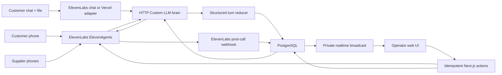
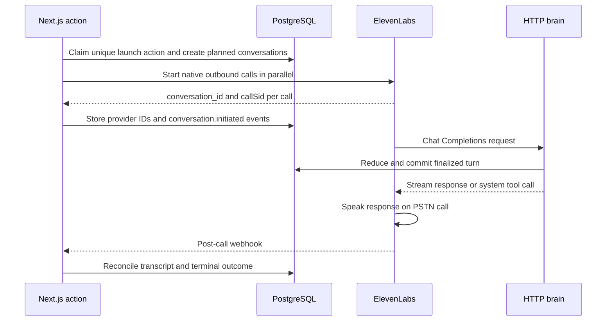

# HTTP Custom LLM MVP blueprint

> Historical blueprint note: the original version assumed a long-lived customer phone call and an undecided chat fallback. The implemented contract uses an ElevenLabs text-only customer agent with a private artifact-marker bridge, plus three supplier voice agents. See [`../call-flow.md`](../call-flow.md) and [`../decisions/0001-http-custom-llm-mvp.md`](../decisions/0001-http-custom-llm-mvp.md) for current decisions.

Status: proposed implementation blueprint  
Runtime choice: ElevenLabs ElevenAgents with an HTTP Custom LLM  
Last verified: 2026-07-19

Open product choices and environment blockers are tracked in [`../pre-build-clarifications.md`](../pre-build-clarifications.md).

## Outcome

The MVP can keep ElevenLabs responsible for telephony audio, speech recognition, turn taking, and speech synthesis while our application owns the reasoning loop and all durable business state.

The central rule is:

> Every finalized caller turn passes through our HTTP brain before the agent answers. Our brain first reduces the new speech into validated domain state, commits that state, loads the newest facts from all concurrent negotiations, and only then streams the spoken response.

This gives us:

- automatic turn-level transcription without relying on model-authored webhook calls;
- one authoritative state machine for intake, quotes, negotiations, and commitments;
- cross-call quote leverage on the next conversational turn;
- a durable event stream for the operator UI;
- versioned use-case configuration instead of use-case-specific database columns;
- the ability to replace ElevenLabs later without replacing the domain model.

This does not provide word-by-word partial captions. The documented HTTP contract exposes the accumulated conversation when ElevenLabs requests the next response, which is sufficient for finalized-turn state updates. True interim captions would require another audio or transcription path.

## MVP boundaries

The engine is use-case agnostic. The first implementation should prove the universal flow with one freight-brokerage configuration and at least one structurally different config fixture:

1. call a customer and collect a complete load;
2. read the load back and obtain explicit confirmation;
3. keep that customer conversation open and originate several supplier calls in parallel;
4. keep the supplier calls open while their offers are clarified and cross-call leverage is applied;
5. update the customer from committed session events while supplier negotiations progress;
6. compare only validated, comparable offers under the pinned use-case policy;
7. recommend and explain the tradeoffs on the still-open customer conversation, then record the customer's explicit selection;
8. ask the selected supplier to confirm the exact job and terms on its still-open call;
9. tell each non-selected supplier the outcome on its still-open call;
10. end all calls and close the session only when every required outcome is terminal.

The engine never contains freight terms. Freight job fields, fees such as insurance or tolls, clarification questions, line items, recommendation rules, and terminology live only in a pinned use-case configuration document.

Not in the first MVP:

- one supplier organization with multiple contacts;
- autonomous discovery of unknown suppliers;
- supplier memory and learned negotiation profiles;
- word-level live captions;
- arbitrary user-authored workflows;
- instantaneous server-pushed speech into an idle PSTN call;
- learning that silently changes behavior without evidence and review.

## Important product decision: keep the customer call open

The customer flow should be:

1. intake and explicit job confirmation;
2. tell the customer that supplier outreach is starting and keep the same call connected;
3. originate the configured supplier calls in parallel;
4. report material progress and verified quotes on the same customer call;
5. explain the deterministic comparison and capture the customer's selection;
6. keep the customer informed while the selected supplier confirms and non-selected suppliers are notified on their still-open calls; use a callback only after an unexpected disconnect or maximum-duration limit.

An HTTP Custom LLM endpoint is reactive: ElevenLabs calls it when a conversation needs a response. The MVP uses ElevenLabs' configurable 1–30 second `turn_timeout` as a bounded polling clock. On each silence-triggered customer turn, the brain loads session events newer than that call's `last_delivered_event_seq`. It reports only material changes and advances the delivery cursor after a completed response. If nothing changed, it returns the `skip_turn` system-tool call so the line stays silent. Supplier calls continue to receive leverage at their next natural turn.

This is periodic freshness, not exact server-pushed interruption. Repeated silence turns on a long PSTN call are a P0 provider-contract spike. If they do not work reliably, the required product flow forces a runtime reconsideration; we do not silently fall back to a separate customer review call.

### Concurrency budget

The customer consumes one voice slot for the complete sourcing round. The current Free/PAYG ElevenAgents allowance is four concurrent calls, so the first proof is exactly one customer plus three suppliers. `supplierParallelism` is configurable, but the runtime must enforce `min(configured parallelism, available voice slots - active reserved slots)` and queue or reject excess work explicitly. Five simultaneous suppliers plus the customer requires at least six available slots, such as the current Starter allowance or burst capacity. Provider entitlements remain live account constraints and must be checked before a demo.

## Sixty-second presentation versus real execution

The full product proof is a real run with one customer and three consenting supplier role-players. It persists provider IDs, uploaded artifacts, transcripts, revisions, and ordered session events.

The judged 60-second story should be a time-compressed replay of one such run. It may accelerate idle time and select short audio/transcript moments; it must not fabricate database events or outcomes. A defensible cut is:

| Time    | Evidence shown                                                                |
| ------- | ----------------------------------------------------------------------------- |
| 0–6 s   | Use-case config plus voice or uploaded-document intake                        |
| 6–12 s  | Missing fields resolve and the customer confirms the exact job revision       |
| 12–20 s | Three supplier conversations appear in parallel                               |
| 20–35 s | Structured offers, a material clarification, and verified cross-call leverage |
| 35–45 s | Configured recommendation and trade-offs; customer selection                  |
| 45–53 s | Winner confirms; non-winners are notified; calls end                          |
| 53–60 s | Audit trail plus a non-freight config fixture using the same engine           |

The core visual sequence is about 25 seconds, but the underlying real call is not expected to complete in 30 seconds. If the judged format is live, connect calls before the clock or replay a prior real run.

## System overview



## Proposed deployment

| Concern                     | MVP component                                    | Reason                                                                                    |
| --------------------------- | ------------------------------------------------ | ----------------------------------------------------------------------------------------- |
| Web application and API     | Next.js on Vercel                                | Existing product target and straightforward HTTP/SSE routes                               |
| Database                    | Supabase PostgreSQL                              | Standard PostgreSQL for Drizzle plus managed realtime and storage                         |
| Schema access               | Drizzle                                          | Requested ORM and transparent SQL migrations                                              |
| Session progression         | Idempotent Next.js route handlers/server actions | The MVP is operator-visible and does not need a separate workflow engine                  |
| UI updates                  | Supabase private Broadcast plus event replay     | Fast fan-out with a durable database source of truth                                      |
| Telephony origination       | ElevenLabs native Twilio outbound API            | Existing imported number; returns `conversation_id` and `callSid` without a custom bridge |
| Voice runtime               | ElevenLabs ElevenAgents                          | Managed STT, turn taking, TTS, and phone bridge                                           |
| Agent reasoning             | Our OpenAI-compatible HTTP endpoint              | Owns state, context, policies, and model choice                                           |
| JSON validation             | AJV with JSON Schema 2020-12                     | Use-case schemas are data and must be versionable                                         |
| Stable transport validation | Zod                                              | Useful only for application-owned envelopes and commands                                  |

Supabase is a replaceable implementation choice. PostgreSQL tables and the event contract are the architectural boundary. Do not add Inngest, Vercel Workflow, Supabase Edge Functions, ElectricSQL, Redis, or an application WebSocket service until a measured requirement justifies one.

## Suggested repository shape

```text
apps/web/
  app/api/brain/v1/chat/completions/route.ts
  app/api/sessions/[sessionId]/start/route.ts
  app/api/sessions/[sessionId]/supplier-rounds/route.ts
  app/api/sessions/[sessionId]/reconcile/route.ts
  app/api/sessions/[sessionId]/events/route.ts
  app/api/providers/elevenlabs/post-call/route.ts

packages/db/
  schema/
  migrations/
  repositories/

packages/use-case-config/
  load.ts
  validate.ts
  compile.ts

packages/domain/
  reducer-contract.ts
  state-machine.ts
  comparisons.ts
  commands.ts

packages/brain/
  route.ts
  history.ts
  execution-ledger.ts
  reducer.ts
  context.ts
  prompt.ts
  stream.ts

packages/providers/
  elevenlabs/

packages/realtime/
  event-contract.ts
  broadcast-trigger.sql

config/use-cases/freight-brokerage/0.1.0.json
config/use-cases/contractor-bids/fixture.0.1.0.json

elevenlabs/
  agents.json
  customer-shell.json
  supplier-shell.json
  tests/
```

## Use-case configuration

One immutable use-case config version is pinned to each session. The core requires a valid config contract but requires no freight config or freight field. The config supplies the job JSON Schema and question plan, file-extraction hints, offer JSON Schema, line-item catalog, clarification rules, negotiation phases/outcomes/leverage, recommendation policy, completion rules, and presentation metadata.

Voice intake, text intake, and file-assisted chat are channel adapters around the same job reducer. Supplier speech is reduced into the configured offer schema. JSON Pointer references connect questions and policies to schema fields; a small allowlisted predicate DSL and versioned normalizer registry provide declarative logic without arbitrary JavaScript, SQL, or network calls.

The detailed contract, compilation rules, and a freight-only example fragment are in [`use-case-configuration.md`](use-case-configuration.md). Use-case agnosticism is not considered proven until a second, structurally different fixture passes the same engine tests without an engine code change.

Configuration can define labels, questions, allowed keys, JSON Schemas, and policy. It must not define arbitrary SQL, network calls, or code expressions. Complex normalization algorithms should be application-owned, versioned functions referenced by a safe key.

## Two reusable ElevenLabs agent shells

Create two minimal agents in ElevenLabs:

### Customer shell

Primary purpose: one long-lived `customer_session` covering intake, sourcing updates, offer review, and selection. It supports PSTN voice and a text-only override. With `file_input` enabled, the chat variant may accept image/PDF conversation files. A recovery callback reuses this shell only after disconnect, maximum duration, or commitment failure.

The official platform supports conversation file upload plus `multimodal_message`, but the exact payload forwarded to an HTTP Custom LLM is not documented. Spike this before implementation. If the same custom brain receives sufficient file content, use ElevenLabs chat directly. Otherwise, implement a Vercel AI SDK chat adapter that uploads/parses the file and invokes the identical job reducer; do not fork the intake state machine.

Enabled system tools should include end call and skip turn. Skip turn is used when a customer silence timeout finds no material update. Other tools should be added only after their behavior is proven.

### Supplier shell

Purpose: one supplier call presents the confirmed job, collects and clarifies a configured offer, negotiates using verified leverage, waits for the customer decision, then either confirms the award or receives the non-selection notice before ending. A callback is a recovery path, not the planned negotiation round.

Candidate system tools are end call, voicemail detection, and keypad tones. Their behavior on native outbound PSTN calls requires a live proof.

Both shells should:

- point to the same HTTP brain;
- contain no freight-specific reasoning;
- use the audio settings supported by the imported native Twilio integration;
- contain only stable voice, interruption, language, and disclosure settings;
- receive purpose and correlation through conversation initiation data.

The shells are transport configuration. The application prompt remains authoritative.

## Why use ElevenLabs native outbound calls

The native endpoint accepts the selected agent, imported phone-number ID, destination, and per-conversation initiation data. Its successful response supplies both `conversation_id` and `callSid`, so the application can correlate the call immediately without owning TwiML or Twilio credentials.

For the MVP UI, use only states that the chosen path can support truthfully:

- initiated;
- connected;
- completed;
- busy;
- failed;
- no answer;
- canceled.

`dialing` is the local state after the application has claimed the action. The successful outbound response correlates provider IDs. `connected` can be inferred from the first brain request and reconciled against the conversation API. Terminal states come from ElevenLabs post-call data and reconciliation. The native API does not expose a configurable Twilio status callback in its public contract, so the UI must not pretend that `ringing` versus `answered` is exact.

Use register-call later only if precise pre-answer Twilio telemetry becomes a demonstrated product requirement. It is unnecessary complexity for the current demo.

## Outbound call sequence



Detailed creation path:

1. An application action claims a unique key such as `(session_id, action_type, round_number)` and creates every planned call row before contacting ElevenLabs.
2. It creates one high-entropy brain token per call and stores only its hash.
3. It validates the configured supplier count against the live concurrency budget.
4. It invokes the native outbound endpoint for the permitted calls in parallel.
5. Each initiation includes the opaque brain token in `conversation_initiation_client_data.custom_llm_extra_body`.
6. It stores the returned `conversation_id` and `callSid`, then emits durable call events.
7. The first valid brain request marks the projection connected.
8. Post-call webhooks and explicit reconciliation produce terminal outcomes.

The action may run directly from an operator command. Automatic launch immediately after customer confirmation may use Next.js `after()` so the customer response can stream first, but this is best-effort background execution inside the function lifetime, not a durable queue. The database action claim prevents two application requests from intentionally launching the same round. The UI must expose `retry` and `reconcile` controls for unresolved actions.

### Call creation ambiguity

A timeout after submitting native outbound creation is not proof that no call was created. Blindly retrying could call a person twice.

Use an application-generated idempotency correlation where the provider permits it. If the response is ambiguous:

1. mark the attempt initiation_unknown;
2. reconcile through ElevenLabs conversation records before retrying;
3. retry only after proving no live or completed call exists.

## Correlation and authentication

Do not trust workspace, session, party, negotiation, or call identifiers supplied as plain request fields.

The custom LLM request should carry one opaque brain token through custom LLM extra body. ElevenLabs forwards that data as elevenlabs_extra_body. Our service resolves the token to:

- one call;
- one workspace;
- one session;
- one party;
- one negotiation if applicable;
- one purpose;
- one pinned use-case config version;
- one pinned prompt and reducer version.

Configure an ElevenLabs Custom LLM API-key secret and require the corresponding credential at the brain endpoint. The current guide shows secret configuration but does not explicitly document the received header shape, so exact header behavior must be captured in the live spike.

Token properties:

- at least 128 bits of entropy;
- hash at rest;
- scoped to one route and one call;
- expires shortly after the expected call window;
- revocable;
- never logged in plaintext;
- not usable as a general session API credential.

ElevenLabs post-call webhooks require the documented HMAC verification over the raw body. The Custom LLM route also requires an application/provider secret plus the call-scoped brain token. Verification must fail closed.

## HTTP brain contract

Expose an OpenAI-compatible Chat Completions route:

```text
POST /api/brain/v1/chat/completions
Authorization: provider-configured secret
Content-Type: application/json
Accept: text/event-stream
```

The route accepts the documented message history, tools, stream flag, and forwarded extra body. Start with Chat Completions rather than Responses API compatibility because it is the narrower documented ElevenLabs contract.

The route has two jobs:

1. derive and commit business state from any newly finalized speech;
2. stream the next spoken response or an ElevenLabs system-tool call.

It is not a thin proxy to a model.

## One brain request

The synchronous path is:

1. authenticate the provider request;
2. resolve the opaque brain token;
3. validate that the call is active and matches the expected shell;
4. canonicalize messages and tools;
5. compute a request fingerprint and logical user-turn frontier;
6. claim or replay an execution ledger row;
7. determine whether a new finalized user turn exists;
8. persist that transcript evidence;
9. run the structured reducer when needed;
10. validate reducer output against application and pinned use-case schemas;
11. transactionally commit revisions, projections, events, and update-delivery rows;
12. load the newest session state and verified cross-call facts;
13. build the deterministic response prompt;
14. stream the model response in OpenAI-compatible SSE;
15. persist the final assistant turn and replay envelope;
16. mark the execution completed;
17. let the committed `session_events` trigger notify the UI.

Reducer-before-response adds latency, but it guarantees that the response sees committed state. Start sequentially, measure the full first-audio budget, and optimize only after correctness tests pass.

## Canonical history and logical turns

ElevenLabs sends accumulated messages. The documentation does not promise a unique provider turn ID for each HTTP request. It may also call the endpoint again after a system-tool result, after a retry, or around an interruption.

Therefore one HTTP request must not be assumed to equal one new caller turn.

Canonicalization should:

- preserve message order;
- preserve repeated utterances;
- normalize only transport-level differences such as absent empty fields;
- preserve assistant tool calls and tool results;
- include the declared tool contract;
- never sort conversational messages;
- version the canonicalization algorithm.

Compute:

```text
request_fingerprint =
  SHA256(
    canonicalization_version
    + call_id
    + canonical_full_history
    + canonical_tools
  )

logical_user_turn_key =
  "u:" + user_ordinal
  + ":" + SHA256(canonical_history_through_that_user_message)
```

History classification:

| Shape                                            | Interpretation                               | Reducer action                                                    |
| ------------------------------------------------ | -------------------------------------------- | ----------------------------------------------------------------- |
| Exact previous history plus one new user message | New finalized caller turn                    | Reduce once                                                       |
| Identical history                                | Retry or repeated generation request         | Replay or regenerate without state mutation                       |
| Only assistant tool call or tool result appended | Continuation of same logical turn            | Do not reduce caller state again                                  |
| Assistant suffix differs                         | Interruption or abandoned generation         | Mark old generation aborted; do not invent a final assistant turn |
| Prior user text differs                          | Transcript correction or provider divergence | Quarantine derived shareable leverage until reconciled            |

This algorithm is an application design inference. Retry, correction, system-tool, and interruption shapes must be captured from real calls before production.

## Execution ledger and concurrency

Use `conversation_turn_executions` as an idempotency and replay ledger:

```text
received → reducing → state_committed → generating → completed
         ↘ failed                  ↘ aborted
```

Required data includes:

- conversation and session IDs;
- request fingerprint;
- logical user-turn key;
- canonical transcript snapshot;
- attempt count;
- lease owner and lease expiry;
- reducer and prompt versions;
- reducer output;
- committed event sequence visible to the response;
- normalized final response envelope, including system tool calls;
- stored SSE replay payload or an equivalent deterministic serializer;
- timings and failure reason.

Concurrency behavior:

- first request inserts or claims the execution with a short lease;
- a duplicate completed request replays the stored response;
- a duplicate active request waits briefly and then replays;
- an expired lease can be reclaimed with an incremented attempt count;
- only one execution may commit a given logical user turn;
- business writes use row versions or locked projections;
- event sequence assignment happens in the same transaction as the state change.

Do not hold a database transaction open while waiting for a language model to generate spoken text.

## Structured turn reducer

The reducer is a separate, fast structured-output model call. It never speaks to the caller and cannot invoke external tools.

Inputs:

- latest newly finalized caller turn;
- prior relevant transcript window;
- call purpose;
- current job or offer projection;
- current negotiation phase;
- pinned job and offer schemas;
- allowed state transitions;
- the previous question or readback;
- current verified leverage facts.

Output envelope:

```json
{
  "observations": [],
  "patches": [],
  "proposedTransition": null,
  "confirmation": {
    "kind": "none",
    "subject": null
  },
  "clarificationNeeds": [],
  "terminalOutcome": null
}
```

Each observation must contain an evidence span or message reference and a confidence. Application code, not the reducer, enforces:

- allowed JSON pointers;
- JSON Schema validity;
- allowed transition edges;
- purpose-specific command permissions;
- exact confirmation requirements;
- offer comparability rules;
- leverage shareability rules;
- optimistic-concurrency checks.

If reducer output is malformed or unsupported, store the evidence and emit a clarification need. Do not update a quote, selection, award, or shareable leverage fact from invalid output.

### Customer intake across voice, chat, and files

The reducer:

- patches a new immutable job revision;
- computes missing required JSON pointers;
- detects ambiguity and contradictions;
- distinguishes a draft from an explicitly confirmed job.

Sourcing can begin only after the agent reads back the normalized job and the customer explicitly confirms it.

Both intake adapters write the same `job_revisions`. File-assisted chat may provide the initial evidence and ask follow-up questions; voice may independently collect the same fields or confirm/fill the document-derived draft. The exact confirmed revision—not a model summary—is reused for every supplier.

### Supplier configured offer

The reducer captures:

- fit and capacity;
- structured line items;
- totals and currency;
- inclusions and exclusions;
- assumptions and conditions;
- quote validity;
- firmness;
- callback commitment or decline;
- negotiation phase and terminal outcome.

A vague range is draft evidence. It is not a comparable or shareable offer until policy requirements are met.

### Supplier negotiation on the same call

The reducer compares each new statement with the prior immutable offer revision, records movement, and recognizes whether the supplier explicitly confirms the offer. After an initial comparable offer, the supplier call remains open. Silence turns either deliver newly verified leverage or call `skip_turn`; a planned second callback is unnecessary.

The agent may cite only verified shareable leverage selected by application code.

### Customer review

Offer normalization and ranking are deterministic application functions. The reducer captures questions, constraints, and the customer's explicit selection.

The agent must read back the selected supplier and exact terms. A recommendation is not a selection, and a selection is not yet a completed award.

### Supplier commitment

The reducer recognizes commitment only after the exact job and agreed terms are read back and explicitly accepted. A previously quoted price is insufficient by itself.

### Supplier closeout

Capture delivery of the non-selection notice, any useful feedback, and terminal status. Do not reopen price bargaining unless an authorized session action explicitly starts another round.

## Response context and prompt

Build the response prompt deterministically from committed data:

1. identity, disclosure, and legal policy;
2. call purpose;
3. confirmed job facts;
4. counterparty identity and session-local evidence;
5. current negotiation state;
6. current offer and missing fields;
7. newest verified shareable leverage;
8. one next objective;
9. available ElevenLabs system tools;
10. honesty and commitment boundaries;
11. concise phone-conversation style.

Never inject raw transcripts from another supplier. Inject normalized facts with provenance and policy:

```json
{
  "factKey": "best_comparable_total",
  "amount": 1500,
  "currency": "USD",
  "conditionsSummary": "all-in except detention",
  "sourceOfferRevisionId": "opaque-id",
  "validUntil": "2026-07-19T18:00:00Z",
  "shareability": "amount_without_identity"
}
```

The model may say that another comparable offer is 1500 dollars only while this fact remains valid and shareable. It may not identify the competing supplier unless policy explicitly permits it.

If the database or context loader is unavailable, the agent may continue only with non-transactional conversational repair. It must not invent quotes, claim a selection, or commit a deal.

## Tools and application commands

ElevenLabs system tools such as end call arrive in the request tool list and can be returned as standard function calls. Keep those separate from business commands.

Business state normally changes through the automatic reducer. Explicit operator commands can include:

- confirm job;
- start sourcing;
- record callback outcome after an unexpected disconnect or supplier request;
- compute comparison;
- record customer selection;
- begin supplier commitment;
- revoke selection;
- request call end.

Every command requires:

- workspace and session authorization;
- current expected state;
- idempotency key;
- schema validation;
- evidence or actor provenance;
- transactional state and event writes.

The language model does not receive a generic write-database tool.

## Parallel negotiation and leverage

Every active supplier call receives new committed facts at its next response turn. That creates bounded live cross-call negotiation:

1. carrier A states a valid 1500-dollar offer;
2. A's reducer commits the offer revision and a shareable leverage fact;
3. the session event sequence advances;
4. carrier B finishes speaking;
5. B's brain request loads the newer event sequence;
6. B's response can ask whether it can beat the verified 1500-dollar comparable offer.

This is turn-boundary live injection, not mid-sentence interruption.

The reliable MVP strategy keeps all four participants connected:

- collect and clarify the first comparable offer from each supplier;
- use silence-triggered turns plus `skip_turn` while calls wait;
- deliver verified leverage to still-open supplier calls and record any revised terms;
- update the still-open customer conversation;
- compute configured recommendation outputs and let the customer select;
- obtain exact confirmation from the winner;
- notify non-selected suppliers and end every call.

One negotiation normally maps to one supplier call in the demo. The schema still permits multiple attempts after disconnects or supplier-requested callbacks.

## Operator-visible session state machine

The MVP does not need Vercel Workflow, Inngest, or a Supabase Edge Function. PostgreSQL holds the state machine; short idempotent Next.js actions perform each external transition. Automatic post-confirmation launch is an optimization around the same action, and the operator UI remains the recovery surface.

Recommended progression:

```text
session.created
  → customer intake call
  → wait for confirmed job
  → keep customer call open
  → claim supplier-round launch action
  → start permitted supplier calls in parallel
  → collect and clarify configured offers
  → keep supplier calls open
  → deliver verified leverage on silence or natural turns
  → normalize and compare revised offers
  → present recommendation on the open customer call
  → capture explicit customer selection
  → request exact confirmation on the selected supplier's open call
  → if commitment fails, update the still-open customer
  → notify non-selected suppliers on their open calls
  → end all customer and supplier calls
  → verify all closeout outcomes
  → session.completed
```

No Vercel request remains open while humans answer phones. The phone conversations live at ElevenLabs; Vercel requests only initiate a call, answer one custom-LLM turn, ingest a webhook, query current state, or reconcile. Deadlines and retries are checked when the UI loads, when a provider event arrives, or when the operator invokes reconciliation. This is intentionally sufficient for the MVP and not a claim of production-grade unattended orchestration.

## Realtime UI contract

PostgreSQL remains the source of truth. Every meaningful transaction appends one or more session_events with a strictly increasing per-session sequence.

Durable event examples:

```text
session.status_changed
job.revision_created
job.confirmed
conversation.initiated
conversation.connected
conversation.ended
conversation.failed
transcript.turn_finalized
negotiation.phase_changed
offer.revision_created
offer.became_comparable
leverage.fact_created
leverage.fact_revoked
comparison.completed
customer.offer_selected
award.confirmed
supplier.closeout_completed
```

A database trigger broadcasts committed `session_events` to a private session channel. The event table, not Broadcast retention, is the durable source. The web client:

1. loads the current projection and latest sequence;
2. subscribes to the private channel;
3. applies events in sequence;
4. detects a gap;
5. fetches missing events from the session events endpoint;
6. resumes live application.

Assistant generation deltas can be broadcast as ephemeral events for visual polish, throttled to roughly 100 milliseconds. Persist the final assistant turn, not one database row per token.

Provider and post-call records may arrive late or be duplicated. Apply call projection transitions monotonically and preserve raw evidence without rolling visible state backward.

## Post-call reconciliation

The HTTP brain provides fast finalized turns, while the ElevenLabs post-call webhook provides the final provider record and artifacts.

On post-call:

1. verify the raw-body HMAC;
2. resolve the provider conversation and call;
3. upsert provider IDs and terminal metadata;
4. store or reference the final transcript and audio according to retention policy;
5. compare the final transcript with live evidence;
6. append correction revisions rather than overwriting history;
7. revoke leverage derived from materially corrected evidence;
8. emit reconciliation events;
9. refresh the operator-visible session projection.

If a webhook does not arrive by a deadline, poll the official conversation-details endpoint with bounded retries. A completed phone call and a completed ElevenLabs analysis are separate states.

## Failure policy

| Failure                                     | Required behavior                                             |
| ------------------------------------------- | ------------------------------------------------------------- |
| Invalid provider authentication             | Reject and do not speak or mutate state                       |
| Brain token invalid, expired, or mismatched | Fail closed and emit a security event without token material  |
| Database unavailable before response        | Do not state transactional facts or commitments               |
| Reducer timeout or malformed output         | Keep evidence pending and ask a safe clarification            |
| Response-model timeout                      | Use one short deterministic repair or apology and end safely  |
| Duplicate HTTP request                      | Claim once or replay the completed response                   |
| Tool-result continuation                    | Do not reduce the same user speech twice                      |
| Transcript divergence                       | Append correction evidence and quarantine affected leverage   |
| Status callback out of order                | Apply provider sequence and monotonic projection rules        |
| Twilio creation timeout                     | Mark initiation_unknown and reconcile before any retry        |
| Duplicate Twilio connect webhook            | Return cached TwiML for the existing registration             |
| Missing post-call webhook                   | Poll conversation details after a bounded delay               |
| Supplier commitment fails                   | Mark failure, preserve selected terms, and return to customer |
| All suppliers unreachable                   | Report the actual outcome; never fabricate an offer           |

## Security, privacy, and legal controls

Before real external calls:

- document caller identity and AI disclosure behavior;
- obtain legal review for recording and transcription by jurisdiction;
- separate production from demo phone numbers and data;
- encrypt secrets and sensitive artifacts;
- use least-privilege provider keys;
- restrict private realtime channels by workspace membership;
- redact phone numbers and tokens from logs;
- define transcript and audio retention;
- provide deletion and subject-access paths;
- protect against prompt injection in caller speech, uploaded documents, and use-case configuration;
- require human approval for any policy-defined high-value commitment.

The system should never present inferred personality labels as objective facts. Supplier memory is evidence-backed operational history with sample size, time range, confidence, and provenance.

## Observability

Trace one correlation chain across:

```text
session
→ session action
→ call
→ Twilio CallSid
→ ElevenLabs conversation
→ brain request
→ logical user turn
→ reducer execution
→ state revisions
→ session events
→ model generation
→ post-call reconciliation
```

Measure:

- answer and call completion rates;
- brain time to first streamed token;
- reducer latency and validation failures;
- duplicate and lease-recovery rates;
- transcript divergence rate;
- state-to-UI broadcast latency;
- quote completeness and comparability;
- unsupported claims in generated speech;
- commitment and closeout completion;
- cost per completed session.

Log model and prompt versions, but never plaintext tokens or unnecessary full sensitive payloads.

## Test strategy

### Deterministic unit tests

- use-case config publication and immutability;
- JSON pointer allowlists;
- state-transition validation;
- history canonicalization;
- logical user-turn detection;
- offer normalization;
- leverage eligibility and revocation;
- ranking determinism;
- event sequence assignment;
- call-state monotonicity.

### Contract fixtures

Capture sanitized provider payloads for:

- first custom LLM request;
- repeated request;
- interrupted assistant response;
- tool call and tool result continuation;
- transcript correction;
- duplicate or delayed native initiation results;
- duplicated post-call delivery;
- ElevenLabs post-call webhook.

### Adversarial conversations

- caller changes an earlier job detail;
- supplier gives a range, then a firm quote;
- supplier excludes a material line item;
- supplier withdraws a quote already used as leverage;
- supplier asks which competitor bid;
- customer selects ambiguous terms;
- caller tells the model to ignore policy;
- a second active call commits newer state during generation.

### End-to-end proof

The proof passes only if:

1. one customer call produces a schema-valid confirmed job;
2. file-assisted chat and voice intake both create revisions of the same configured job schema;
3. that same customer call remains open during sourcing;
4. one customer plus three simultaneous supplier calls fit the current four-call budget;
5. a supplier event committed while the customer is silent is spoken on a later silence-triggered turn without customer speech;
6. a valid offer from one supplier call is visible to another still-open call and measurably changes price or terms;
7. suppliers remain connected until the customer decides, then the winner confirms and non-winners are notified before calls end;
8. every browser receives ordered state events without refresh and repairs gaps from PostgreSQL;
9. one duplicate brain request produces no duplicate revision or outbound call;
10. one interrupted response produces no false final assistant turn or delivered-update cursor;
11. customer selection and supplier commitment remain distinct;
12. post-call reconciliation preserves an audit trail.

## Implementation slices

### Slice 0: capture real provider contracts

- configure a minimal HTTP brain;
- place one native ElevenLabs outbound call with a scoped brain token;
- record sanitized request, retry, interruption, tool, and webhook shapes;
- measure response timing;
- prove repeated 20–30 second silence turns on one long-lived PSTN call;
- prove an ElevenLabs text-only conversation can upload a PDF and deliver usable file input to the same HTTP custom brain, or select the Vercel chat adapter fallback.

Do not build the full state engine until this spike confirms the undocumented edges.

### Slice 1: config compiler and database kernel

- publish the domain-neutral meta-schema;
- compile a freight example plus one structurally different non-freight fixture through the same engine tests;
- implement universal tables and Drizzle migrations;
- implement revisions, event sequence, action claims, and database-triggered Broadcast;
- add row-level workspace authorization.

### Slice 2: shared customer intake

- implement authentication, token resolution, canonical history, and execution ledger;
- implement the intake reducer;
- attach voice and file-assisted chat adapters to that reducer;
- render missing fields and readback;
- obtain explicit confirmation;
- keep the call open and prove the update-delivery cursor.

### Slice 3: telephony lifecycle and UI

- create native ElevenLabs outbound calls;
- store `conversation_id` and `callSid`, then reconcile coarse and terminal states;
- stream durable session events;
- render customer, agent system, and supplier nodes.

### Slice 4: parallel supplier quotes

- claim one supplier-round action and launch calls in parallel through a Next.js action;
- reduce offers into immutable revisions;
- show phases, quotes, failures, and comparability.

### Slice 5: cross-call negotiation

- materialize verified leverage;
- inject it into still-open supplier calls at the next natural or silence-triggered turn;
- use `skip_turn` while no new leverage is available;
- test withdrawal and correction.

### Slice 6: customer selection and commitment

- compute deterministic comparison;
- produce configured eligibility, blockers, warnings, tradeoffs, and one recommendation;
- run customer review on the still-open intake call;
- record explicit selection;
- separately confirm the supplier award on its still-open call.

### Slice 7: closeout

- notify non-selected suppliers on their still-open calls;
- complete terminal session rules;
- end all calls cleanly.

### Slice 8: hardening

- post-call reconciliation;
- load, retry, and chaos tests;
- prompt and policy evaluation;
- security, privacy, and legal review.

## Uncertainties that must remain explicit

1. The precise HTTP authentication headers delivered by ElevenLabs must be observed in a live request.
2. Retry, transcript-correction, tool-continuation, and interruption payload shapes are not fully documented.
3. Repeated silence-triggered turns on an idle PSTN call are documented conceptually but not yet proven for this custom-LLM flow.
4. Native outbound does not expose exact `ringing` versus `answered` callbacks in its public request contract.
5. An ambiguous native outbound timeout requires provider reconciliation before retry; exact lookup ergonomics need a spike.
6. Keypad, voicemail, and long-call maximum-duration behavior need live proof.
7. The use-case configuration contract and safe predicate/normalizer registries need implementation and a non-freight conformance fixture.
8. Latency is feasible in architecture but must be measured with the chosen reducer and response models.
9. Recording, transcription, and automated negotiation rules vary by jurisdiction and require legal review.
10. Next.js `after()` is a best-effort convenience for automatic launch, not durable orchestration; operator recovery is an accepted MVP constraint.

## Primary sources

- ElevenLabs, Custom LLM: https://elevenlabs.io/docs/eleven-agents/customization/llm/custom-llm
- ElevenLabs, Personalization and custom LLM extra body: https://elevenlabs.io/docs/eleven-agents/customization/personalization
- ElevenLabs, System tools: https://elevenlabs.io/docs/eleven-agents/customization/tools/system-tools
- ElevenLabs, Native Twilio outbound call: https://elevenlabs.io/docs/eleven-agents/api-reference/twilio/outbound-call
- ElevenLabs, Conversation flow and silence timeout: https://elevenlabs.io/docs/eleven-agents/customization/conversation-flow
- ElevenLabs, Skip turn: https://elevenlabs.io/docs/eleven-agents/customization/tools/system-tools/skip-turn
- ElevenLabs, Chat mode: https://elevenlabs.io/docs/eleven-agents/guides/chat-mode
- ElevenLabs, Conversation file upload: https://elevenlabs.io/docs/eleven-agents/api-reference/conversations/upload-file
- ElevenLabs, Agent WebSocket `multimodal_message`: https://elevenlabs.io/docs/eleven-agents/api-reference/eleven-agents/websocket
- ElevenLabs, Post-call webhooks: https://elevenlabs.io/docs/eleven-agents/workflows/post-call-webhooks
- ElevenLabs, Conversation details API: https://elevenlabs.io/docs/eleven-agents/api-reference/conversations/get
- Supabase, Broadcast: https://supabase.com/docs/guides/realtime/broadcast
- Next.js, `after`: https://nextjs.org/docs/app/api-reference/functions/after
- Vercel, Functions: https://vercel.com/docs/functions
