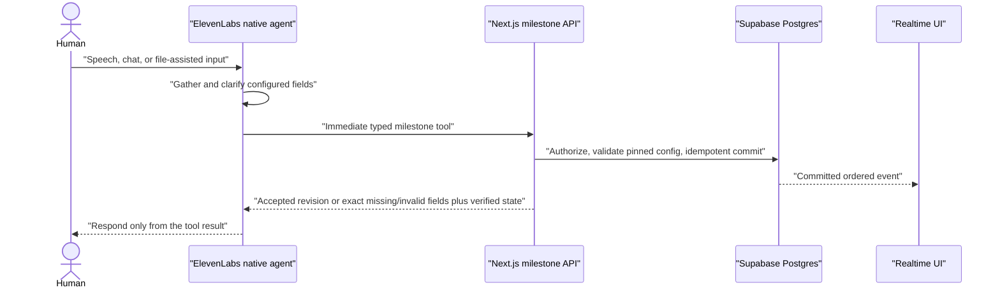

# ADR 0002: use native ElevenLabs agents with milestone webhook tools

Status: accepted
Date: 2026-07-19
Supersedes: [`0001-http-custom-llm-mvp.md`](0001-http-custom-llm-mvp.md)

## Context

The first MVP implementation used an ElevenLabs HTTP Custom LLM so Pacta could inspect every finalized user turn, extract configured job or offer state, persist it, load cross-call context, and stream the spoken response.

Safe deployed tests exposed three separate problems:

1. the model-facing output schema required an observation envelope but did not structurally require every configured field, so a schema-valid response could omit important offer facts;
2. the first persistence implementation held a shared session lock around dozens of cross-region statements, serializing otherwise parallel suppliers;
3. even after the database path was reduced to a few seconds, every spoken turn still depended on an additional extraction model and authoritative commit.

The lock and late-commit bugs were fixed, but the remaining coupling is the wrong MVP boundary. Pacta does not need to persist every utterance. It needs authoritative state at a small number of commercial milestones.

Two local provider proofs change the decision:

- [`../../experiments/elevenlabs/shared-state-negotiation/results/2026-07-19.md`](../../experiments/elevenlabs/shared-state-negotiation/results/2026-07-19.md) proved that two simultaneous native ElevenLabs conversations can publish structured offers through immediate webhook tools, receive verified shared state in the tool result, and use a revised offer in another live conversation at its next turn.
- [`../../scripts/spike-native-elevenlabs-tools.ts`](../../scripts/spike-native-elevenlabs-tools.ts) proved that the current native `gemini-3.1-flash-lite` agent can produce an exact nested webhook payload containing objects, arrays, two line items, booleans, integers, and an explicitly empty array. The deliberately unreachable webhook caused the expected tool-result error; it did not affect the exact captured `paramsAsJson` assertion.

Official ElevenLabs webhook tools support generated parameters, immediate execution, dynamic variables, and tool results returned to the conversation. Tool use remains model-mediated, so reliability must be measured rather than assumed.

## Decision

Use ElevenLabs' native LLM for customer and supplier conversations. Persist only typed business milestones through short Next.js webhook-tool endpoints.

The initial tool set is:

- `submit_confirmed_job` — complete configured job document plus explicit customer-confirmation evidence;
- `submit_offer` — complete configured offer document, final/provisional state, and supporting evidence;
- `get_customer_state` — current sourcing progress, comparable offers, and deterministic recommendation inputs;
- `get_negotiation_state` — current negotiation state and only the anonymous comparable leverage that this supplier may hear;
- `select_offer` — the customer's explicit choice of a current offer revision;
- `commit_selected_offer` — the selected supplier's explicit acceptance of the exact snapshotted terms;
- `record_supplier_outcome` — decline, no answer, callback, and non-selection closeout.

`submit_confirmed_job` and `submit_offer` carry complete state at their milestone. The engine does not ask the model to emit generic JSON-Pointer observations after every turn.

The pinned use-case configuration remains authoritative. A compiler derives the supported ElevenLabs request-body schema and prompt fragments from it. The Next.js endpoint then validates the received document again against the full pinned JSON Schema and business rules before writing anything. Derived values such as normalized totals are computed server-side and are not model parameters.

All authoritative session, conversation, negotiation, party, and config identifiers come from server-supplied dynamic variables or the scoped secret header. The model never supplies tenant authority. Tool handlers are naturally idempotent because ElevenLabs does not document an exactly-once webhook delivery contract:

- the same confirmed job hash is a replay;
- the same offer document and evidence hash is a replay;
- one current selection is permitted per decision revision;
- one award is permitted per session;
- terminal outcomes are monotonic.

Do not mutate the working Custom LLM agents while proving this path. Provision separate native staging agents, keep the deployed Custom LLM endpoint temporarily as rollback, and switch configured agent IDs only after the safe gates pass.

## Runtime sequence

Cross-call state is consumed at a natural or silence-triggered turn through `get_*_state`. This does not provide unsolicited mid-utterance speech. The MVP does not fabricate user messages, attach an enterprise monitoring socket, or build a Twilio media bridge.

## Reliability gates

Before switching production agent IDs, prove all of the following without phones:

1. 20/20 complete customer transcripts call `submit_confirmed_job` exactly once with an exactly valid nested document.
2. 20/20 incomplete customer transcripts do not call it and ask for the missing field.
3. 20/20 complete final supplier quotes call `submit_offer` with every required comparable field.
4. malformed or stale tool bodies are rejected and the agent responds with the returned clarification instead of claiming success.
5. one customer plus three concurrent supplier text conversations complete the safe flow against the deployed Next.js routes.
6. no agent says confirmed, selected, committed, submitted, or booked before the corresponding successful tool result.

If these gates fail, the fallback is a thin streaming Custom LLM that keeps speech generation separate from asynchronous state reconciliation. Do not restore the previous atomic speech-plus-exhaustive-reduction request path.

## Consequences

Positive:

- ElevenLabs owns the latency-sensitive model, speech, interruption, and tool loop;
- no Pacta extraction-model call or OpenAI-compatible SSE adapter sits in every voice response;
- structured writes happen only when they matter commercially;
- webhook routes are small, independently testable, and use-case configured;
- the existing Postgres, Supabase Realtime, Vercel, and provider-correlation work remains reusable.

Costs and explicit uncertainty:

- tool selection and parameter generation are probabilistic and need repeated evals;
- native tool schemas support a useful recursive subset, not every JSON Schema 2020-12 feature, so the compiler must define a supported MVP dialect and the server must perform authoritative validation;
- file-to-tool extraction still needs a real ElevenLabs chat/file proof;
- provider docs do not expose a webhook delivery ID or guarantee retry semantics;
- exact proactive context injection into an idle PSTN call remains out of scope.

## Primary sources

- ElevenLabs webhook tools: https://elevenlabs.io/docs/eleven-agents/customization/tools/webhook-tools
- ElevenLabs agent testing: https://elevenlabs.io/docs/eleven-agents/customization/agent-testing
- ElevenLabs dynamic variables: https://elevenlabs.io/docs/eleven-agents/customization/personalization/dynamic-variables
- ElevenLabs standalone agent tools: https://elevenlabs.io/docs/eleven-agents/customization/tools/agent-tools-deprecation
- ElevenLabs Custom LLM rollback contract: https://elevenlabs.io/docs/eleven-agents/customization/llm/custom-llm
