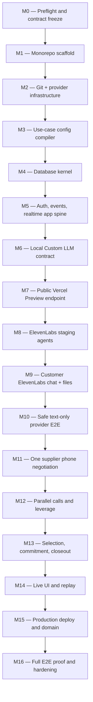

# Implementation plan and milestone gates

Status: active execution plan with verified progress  
Last updated: 2026-07-19  
Target: a complete, evidence-backed session on `https://pacta.openexp.dev`

This plan converts the accepted call flow and architecture into independently verifiable milestones. Every milestone must leave the repository deployable, produce evidence that its boundary works, remove temporary data/resources, and pass an explicit exit gate before the next milestone starts.

This document records both the gated plan and current execution state. Infrastructure/deployment work is authorized by the active build request. Real outbound phone calls remain separately disarmed until explicit approval.

## Current observed state

Verified on 2026-07-19:

- The Node 24/pnpm monorepo, Next.js application, shared packages, CI, mascot-centered UI, and browser test are implemented. The desktop currently runs Node 26, which produces an expected engine warning; CI and Vercel use Node 24.
- The public GitHub repository `ralfboltshauser/hack-nation-2026_pacta` is pushed on `main`; GitHub CI passes on the protected implementation commit.
- The manually created Supabase project is healthy. Seven migrations apply from a blank PostgreSQL 17 database and on the hosted project. The private bucket, anonymous Auth, membership-scoped RLS, and Realtime access were functionally tested.
- Stripe Projects is initialized locally for inventory, but its Supabase resource creation failed at the provider boundary. The manual Supabase project is the accepted fallback; do not retry the broken resource.
- The separate Vercel project `pacta-negotiator` uses `apps/web` as its monorepo root and is healthy at `https://pacta.openexp.dev`; the unrelated `pacta-character` project was not mutated. Production Supabase, model, security, and disarmed telephony variables are present. Its default function region is now `dub1`, beside Supabase Ireland; the change takes effect with the next deployment.
- The private ElevenLabs customer and supplier agents point to the production Custom LLM endpoint. The workspace post-call webhook is HMAC-signed and its secret is stored only in Vercel. The supplier agent permits a signed text-only override for the no-phone harness.
- Outbound telephony is fail-closed unless `PACTA_OUTBOUND_CALLS_ENABLED` is exactly `true`. It remains `false`; no friend phone has been called.
- The original Custom LLM failure is fixed: descriptive AI SDK structured output plus Gemini 2.5 Flash Lite completed both deployed customer turns without a retry. A terminal-conversation commit guard passes against hosted Postgres.
- The safe three-supplier trace exposed shared-session-lock serialization, not model serialization. Evidence inserts are now bulked, exact lock timings are instrumented, and the `dub1` deployment plus repeat trace are the next gate.
- Authenticated private Realtime Broadcast and durable HTTP replay are verified in production. A first-connect `MissingPartition` race was reproduced, so the UI now retries the subscription with bounded backoff and relies on replay for correctness.
- A clean local schema rebuild, automated tests, lint, typecheck, production build, Playwright UI test, GitHub CI, production TLS/liveness, and production database readiness pass. The complete deployed safe harness, exact deployed ElevenLabs file bridge, and real supplier-call behavior still require provider proof.

## Target repository shape

```text
apps/
  web/                         Next.js App Router UI and all HTTP/server actions
    public/mascot/             Web-optimized mascot model and static fallback
packages/
  core/                        Reducers, commands, state transitions, events
  db/                          Drizzle schema, migrations, queries, transactions
  use-case-config/             Meta-schema, compiler, predicate/normalizer registry
  elevenlabs/                  Provider client, payload schemas, prompt builders
  test-fixtures/               Sanitized provider and use-case fixtures
config/
  use-cases/
    freight-brokerage/
    contractor-bids/
  elevenlabs/                  Checked-in agent/tool/test configuration
docs/
  milestones/evidence/         One verification record per completed milestone
mascot/                         Source-of-truth Blender model, export pipeline, motion rig, and reference viewer
```

There is one deployable application: `apps/web`. API routes live in that Next.js application; shared packages are libraries, not separately deployed services.

## Target infrastructure contract

| Concern                                           | MVP choice                                                                                                                        |
| ------------------------------------------------- | --------------------------------------------------------------------------------------------------------------------------------- |
| Provisioning inventory and credential pull        | Stripe Projects when the account is eligible; direct provider provisioning with a checked-in inventory is the accepted fallback   |
| Git/CI source                                     | Public GitHub repository `ralfboltshauser/hack-nation-2026_pacta`                                                                 |
| Application, server actions, APIs, Custom LLM SSE | Next.js on Vercel                                                                                                                 |
| Database, Auth, Realtime, private files           | One new Supabase project                                                                                                          |
| Schema and migrations                             | Drizzle with reviewed SQL migrations                                                                                              |
| Voice runtime and native outbound calls           | ElevenLabs Agents                                                                                                                 |
| Underlying carrier / direct Twilio REST           | Twilio remains behind ElevenLabs for the MVP; direct app access is conditional and must not create a second call-origination path |
| Reducer/response models                           | Vercel AI Gateway or explicitly selected upstream                                                                                 |
| Local logic proof                                 | Automated tests against local Next.js                                                                                             |
| First public provider proof                       | Vercel Preview, not a Quick Tunnel                                                                                                |
| Production domain                                 | `pacta.openexp.dev` on the existing Vercel DNS zone                                                                               |

Do not add Supabase Edge Functions, Vercel Workflow, Inngest, Redis, ElectricSQL, or a separately hosted application WebSocket service unless a measured milestone failure requires one.

## Dependency order



## Rules for every milestone

Each milestone ends with:

1. implementation scoped only to that milestone;
2. automated checks plus the listed manual/provider proof;
3. a short `docs/milestones/evidence/MXX-*.md` record containing commands, sanitized outputs, IDs, timings, and known failures;
4. cleanup of test rows, files, calls, temporary URLs, debug logging, and unused provider resources;
5. a focused commit/tag after secrets and generated junk are excluded;
6. no continuation while its exit gate is red.

Never put secrets, phone numbers, raw recordings, full transcripts, brain tokens, or provider authorization headers in commits or evidence files.

## Milestone summary

| ID  | Outcome                                                      | Independent proof                                                                                                         |
| --- | ------------------------------------------------------------ | ------------------------------------------------------------------------------------------------------------------------- |
| M0  | Frozen implementation contract and safe environment baseline | Preflight report is complete and contains no secrets                                                                      |
| M1  | Buildable Next.js monorepo                                   | Clean install, lint, types, tests, and production build pass                                                              |
| M2  | Git-backed infrastructure with Supabase and Vercel           | Provider inventory, preview health route, and DB probe pass; Stripe status is healthy or its account blocker is evidenced |
| M3  | Use-case-agnostic config compiler                            | Freight and non-freight fixtures compile through identical code                                                           |
| M4  | Drizzle/Postgres kernel                                      | Blank migration, invariants, idempotency, and event replay tests pass                                                     |
| M5  | Authenticated realtime application spine                     | A committed synthetic event reaches UI and gap replay repairs it                                                          |
| M6  | Correct local Custom LLM endpoint                            | Fixture request reduces once and streams valid SSE                                                                        |
| M7  | Public preview integration URL                               | External `curl -N` observes streaming through Vercel                                                                      |
| M8  | Customer and supplier ElevenLabs staging agents              | Agent simulations and one text turn reach our handler                                                                     |
| M9  | Customer ElevenLabs chat and document intake                 | Typed/PDF/image turns produce evidenced revisions and explicit confirmation                                               |
| M10 | Safe provider E2E without telephony                          | Customer plus three supplier text conversations exercise the complete reducer and closeout                                |
| M11 | One real supplier negotiation                                | Exact job is presented and one comparable offer is captured                                                               |
| M12 | Three parallel suppliers with live leverage                  | One offer measurably affects another still-open negotiation                                                               |
| M13 | Closed commercial loop                                       | Customer selects, winner confirms, losers are notified                                                                    |
| M14 | Faithful live/replay UI with Pacta at its center             | Browser reconstructs the session and mascot behavior only from events/projections                                         |
| M15 | Production deployment at target domain                       | Domain, TLS, env, webhooks, agents, and production smoke pass                                                             |
| M16 | Reproducible four-person E2E evidence run                    | Full acceptance matrix passes and temporary resources are cleaned                                                         |

---

## M0 — Preflight, decisions, and repository safety

**Depends on:** nothing

### Implement

- Re-run repository, Git, Stripe Projects, Vercel, domain, ElevenLabs-account, and concurrency checks.
- Pin decisions from:
  - [`call-flow.md`](call-flow.md)
  - [`architecture/use-case-configuration.md`](architecture/use-case-configuration.md)
  - [`architecture/database-schema.md`](architecture/database-schema.md)
  - [`decisions/0001-http-custom-llm-mvp.md`](decisions/0001-http-custom-llm-mvp.md)
- Create the initial environment-variable inventory with public/server-only classification.
- Normalize the Twilio credential contract before application code exists: `TWILIO_ACCOUNT_SID` (`AC…`), `TWILIO_API_KEY_SID` (`SK…`), and `TWILIO_API_KEY_SECRET`. Treat the current `TWILIO_SID` and `TWILIO_CLIENT_SECRET` names as temporary aliases to migrate, because they hide which Twilio credential types they contain.
- Record whether the Twilio key is Main, Standard, or Restricted and its region. Prefer a least-privilege Restricted key if direct Twilio REST access becomes necessary.
- Decide recording/AI-disclosure language for calls to the four consenting friends.
- Confirm the four-call concurrency entitlement immediately before telephony milestones.
- Pin Node 24 through `.nvmrc`/`.node-version` and `engines`.
- Extend `.gitignore` for `.env*`, `.vercel`, Stripe Projects local credential outputs, recordings, provider payload captures, and test artifacts while preserving `.env.example`.

### Verify

- `git status` shows the intended baseline only.
- Secret scanning finds no credential values in tracked candidates.
- `stripe projects status` truthfully reports no local project before provisioning.
- `vercel whoami` and domain inspection identify the intended team/domain.
- A written decision says the demo uses one customer and three suppliers.
- Twilio credential shape checks pass without printing values. Once `TWILIO_ACCOUNT_SID` exists, a read-only request against an account-scoped resource authenticates with the API Key SID as username and API Key Secret as password; record only the status/resource SID fingerprint.

### Cleanup

- Remove any accidental secret-bearing shell/output files.
- Redact provider IDs and phone numbers from preflight evidence.
- Do not provision or call anything yet.

### Exit gate

Green only when the baseline can be committed without secrets and no product-state conflict remains unresolved.

---

## M1 — Initialize the Next.js monorepo

**Depends on:** M0

### Implement

- Use pnpm workspaces plus Turborepo.
- Create `apps/web` with current stable Next.js App Router, TypeScript, React, ESLint, and the selected styling stack.
- Create the shared package directories from the target repository shape.
- Add root scripts: `dev`, `build`, `lint`, `typecheck`, `test`, `format:check`.
- Add a root lockfile and pin all versions through it.
- Configure package imports and Next.js `transpilePackages` only where required.
- Add:
  - `/` minimal application shell;
  - `/api/health/live` process health;
  - `/api/health/ready` dependency-aware readiness stub.
- Preserve the existing docs, experiments, resources, and UI exploration.

### Verify

- Fresh Node 24 environment can run `pnpm install --frozen-lockfile`.
- `pnpm lint`, `pnpm typecheck`, `pnpm test`, and `pnpm build` all pass.
- `pnpm dev` serves the page and both health routes locally.
- Shared packages can be imported by `apps/web` without path hacks.

### Cleanup

- Remove Create Next App sample assets/copy not used by Pacta.
- Remove duplicate lockfiles and accidental npm/yarn artifacts.
- Ensure no generated build directory is tracked.

### Exit gate

Green only when a clean clone can build the one deployable web app from root commands.

---

## M2 — Git remote and provider infrastructure

**Depends on:** M1

### Implement

1. Use the authorized public GitHub repository `ralfboltshauser/hack-nation-2026_pacta`, add the remote, and push the baseline only after a public-repository secret/privacy audit. Protect `main` if practical.
2. Run Stripe Projects initialization preflight. If the account is eligible, initialize this directory:

   ```text
   stripe projects init pacta
   ```

3. When initialized, create a Stripe Projects development environment whose output is the ignored Next.js env file:

   ```text
   stripe projects env create development --output apps/web/.env.local
   ```

4. Run preflight before every provision:

   ```text
   stripe projects add supabase/project --name app-db --preflight
   stripe projects add vercel/project --name web --preflight
   ```

5. If preflight remains `ACCOUNT_NOT_ELIGIBLE`, retain sanitized evidence and provision the same resources directly through their official management surfaces. Keep a checked-in provider inventory so the resources can later be linked/imported into Stripe Projects without changing application architecture. Provision:
   - one new Supabase free project in the nearest suitable European region;
   - one new Vercel Hobby project named distinctly from `pacta-character`, preferably `pacta-negotiator`;
   - connect the Vercel project to the new Git repository and `apps/web`.
6. Add both resources to the active Stripe Projects environment and pull variables locally when available; otherwise map direct provider outputs explicitly into the ignored app env file and Vercel environment scopes.
7. Configure Vercel monorepo build/install settings and deploy the minimal app.
8. Keep `exa/api` unprovisioned until supplier discovery becomes scope.

Exact provider configuration arguments must come from `--preflight`/interactive provider prompts; do not guess or script around missing required data.

### Verify

- `stripe projects status` shows the intended resources, or the M2 evidence contains the current `ACCOUNT_NOT_ELIGIBLE` result plus the equivalent direct-provider inventory.
- The selected inventory path shows required names with redacted values.
- The Vercel preview serves `/api/health/live`.
- A server-only readiness probe can connect to Supabase without exposing credentials.
- The Git push triggers a preview deployment.
- No resource named `pacta-character` was changed.

### Cleanup

- Remove duplicate/failed resources created during provisioning.
- Remove test database rows.
- Ensure pulled env files are ignored and `.env.example` contains names only.

### Exit gate

Green only when one commit deterministically produces one healthy preview deployment and one verified database connection. Stripe account eligibility may remain an evidenced provider-level limitation; missing application infrastructure may not.

---

## M3 — Build the use-case configuration compiler

**Depends on:** M2

### Implement

- Implement JSON Schema 2020-12 meta-validation for the contract.
- Add typed application envelopes for:
  - config publication;
  - job/offer validation results;
  - allowed predicates;
  - normalizer/adapter registry references.
- Validate JSON Pointers against job and offer schemas.
- Type-check clarification, eligibility, leverage, and recommendation predicates.
- Reject arbitrary code, SQL, regex execution, network calls, secrets, and unknown keys.
- Compile:
  - freight-brokerage `0.1.0`;
  - one structurally different contractor-bids fixture.
- Generate deterministic content hashes and compiled prompt/presentation fragments.

### Verify

- Both fixtures compile through identical engine code.
- Invalid pointers, cycles, unknown normalizers, unsafe keys, and malformed transition graphs fail with actionable errors.
- Complete/incomplete job fixtures and comparable/blocked offer fixtures behave deterministically.
- Editing a published config changes its hash and cannot reinterpret existing fixture sessions.

### Cleanup

- Remove temporary freight logic from shared code.
- Ensure no domain word is required by compiler tests.

### Exit gate

Green only when the non-freight fixture requires zero engine-code branches.

---

## M4 — Implement the Drizzle/Postgres database kernel

**Depends on:** M3

### Implement

- Put Drizzle schema/migrations in `packages/db`; consume them from the Next.js app.
- Use Supabase’s pooled runtime connection and a direct migration connection.
- Implement the MVP entities:
  - workspaces;
  - use cases and immutable config versions;
  - parties;
  - sessions;
  - jobs, revisions, and confirmations;
  - session suppliers;
  - negotiations;
  - conversations, turns, and turn executions;
  - offers and revisions;
  - leverage facts and context injections;
  - comparison runs;
  - customer decisions;
  - awards;
  - session events and session actions;
  - artifacts and evidence.
- Do not implement supplier-memory tables.
- Implement:
  - foreign keys and tenant boundaries;
  - published-config immutability;
  - revision uniqueness;
  - per-session event sequencing;
  - optimistic state versions;
  - idempotent action/execution constraints;
  - award/confirmation invariants.
- Add private Storage buckets and artifact metadata policy.
- Add migration/seed/check scripts.

### Verify

- Migrations apply to an empty database.
- A second migration run is a no-op.
- Tests prove:
  - no supplier launch before explicit job confirmation;
  - duplicate execution/action creates no duplicate revision/call;
  - event sequences are contiguous under concurrency;
  - customer selection and award confirmation remain separate;
  - a quote milestone does not close the supplier negotiation;
  - cross-workspace references fail.
- Read/write/storage probes pass from the Next.js runtime.

### Cleanup

- Delete fixture sessions and uploaded objects.
- Remove blanket GIN indexes or speculative tables without a tested query.
- Verify migrations contain no credentials or environment-specific IDs.

### Exit gate

Green only when a blank database can be migrated and all universal invariants pass transaction tests.

---

## M5 — Authentication, session events, Realtime, and app spine

**Depends on:** M4

### Implement

- Add one minimal operator authentication path through Supabase Auth.
- Add RLS for workspace records, Storage objects, and private Realtime topics.
- Broadcast committed `session_events` through a database trigger.
- Implement:
  - session list/detail server reads;
  - `GET /api/sessions/:id/events?after=<seq>`;
  - gap detection/backfill in the browser;
  - a simulated-session development action;
  - a minimal operator screen showing customer, system, suppliers, status, and event log.
- Keep PostgreSQL authoritative; Broadcast is only notification transport.

### Verify

- An authorized browser receives a committed synthetic event without refresh.
- An unauthorized client cannot read the session/topic/object.
- Dropping one Broadcast message and reconnecting repairs the exact gap from PostgreSQL.
- Duplicate/reordered Broadcast messages do not duplicate or roll back UI state.

### Cleanup

- Delete simulated sessions and Realtime messages.
- Remove public topic policies and service-role keys from browser bundles.

### Exit gate

Green only when the browser reconstructs the same state from projection + replay with or without live Broadcast.

---

## M6 — Local HTTP Custom LLM contract

**Depends on:** M5

### Implement

- Add `POST /api/elevenlabs/llm/v1/chat/completions`.
- Implement OpenAI-compatible streamed Chat Completions output.
- Authenticate a provider secret plus a conversation-scoped opaque brain token.
- Implement:
  - accumulated-history canonicalization;
  - logical finalized-turn detection;
  - `conversation_turn_executions` claim/replay;
  - reducer-before-response;
  - schema/transition validation;
  - transactional revisions/events/deliveries;
  - deterministic context assembly;
  - response streaming and completed-turn persistence;
  - aborted/interrupted generation handling.
- Add sanitized request fixtures for initial turn, retry, tool continuation, interruption, and transcript correction.
- Add `/api/elevenlabs/webhooks/post-call` with raw-body signature verification and reconciliation stubs.
- Add `/api/sessions/:id/reconcile` as an authenticated recovery endpoint/action.

### Verify

- Local contract tests send a fixture and receive valid SSE chunks.
- One finalized turn creates exactly one revision under duplicate requests.
- A tool continuation does not reduce the caller again.
- An interrupted generation does not persist a final assistant turn or delivered cursor.
- New committed shared state is present in the next response context.
- Invalid auth/brain tokens fail closed without mutation.

### Cleanup

- Remove raw provider payload logs and temporary tokens.
- Keep only sanitized fixtures with a documented redaction process.

### Exit gate

Green only when the handler is correct locally without any real ElevenLabs agent.

---

## M7 — Public streaming integration through Vercel Preview

**Depends on:** M6

### Decision

Do not use a Cloudflare Quick Tunnel for the Custom LLM proof. Current Cloudflare documentation says Quick Tunnels do not support Server-Sent Events, while the ElevenLabs handler must stream SSE.

Use a Vercel Preview deployment as the first public HTTPS endpoint. Prefer a stable branch preview URL for the staging agent. This tests the actual function runtime, headers, streaming, timeouts, and environment behavior.

If local public tunnelling is later required, use only a named/paid tunnel proven to pass streaming unchanged; keep it outside the production path.

### Implement

- Deploy the M6 endpoint to a dedicated integration branch preview.
- Configure preview-only secrets.
- Add an external smoke script that:
  - checks readiness;
  - posts an authenticated fixture;
  - observes incremental SSE with `curl -N`;
  - validates no proxy buffering;
  - tests post-call signature rejection/acceptance.
- Capture Vercel function timings/log correlation IDs without content/secrets.

### Verify

- The first SSE chunk arrives before the function completes.
- Headers/content type match ElevenLabs’ expected Chat Completions contract.
- Preview database writes and Realtime updates appear in the authorized UI.
- Function duration/memory remain within the selected Vercel plan limits.
- A deployment with a missing required env variable fails readiness clearly.

### Cleanup

- Delete temporary preview-only sessions/tokens.
- Remove obsolete preview deployments/branch aliases when practical.
- Do not leave a random tunnel URL in agent configuration.

### Exit gate

Green only when the public Vercel handler streams correctly and is safe to give to ElevenLabs.

---

## M8 — Create and connect ElevenLabs staging agents

**Depends on:** M7

### Implement

- Pin `@elevenlabs/cli` in the repository; do not depend on an unversioned global install.
- Initialize checked-in ElevenLabs configuration under `config/elevenlabs`.
- Create two thin staging agents because their call purposes differ:
  - Pacta Customer;
  - Pacta Supplier.
- Configure both to use the Vercel Preview Custom LLM endpoint.
- Keep call ownership singular: ElevenLabs' native Twilio outbound endpoint originates MVP calls. Do not add a parallel `twilio.calls.create` path merely because direct Twilio credentials exist.
- Keep use-case behavior out of the ElevenLabs shell; compile it into per-session context.
- Enable only necessary built-in system tools:
  - `end_call`;
  - `skip_turn`;
  - `voicemail_detection` for outbound supplier calls;
  - optional DTMF only if a real test requires it.
- Configure turn timeout/eagerness, voice, interruption behavior, AI disclosure, and recording according to the accepted policy.
- Add ElevenLabs simulation/LLM tests for:
  - explicit job confirmation;
  - refusal to invent missing facts;
  - incomplete offer clarification;
  - non-selection closeout;
  - no commitment without explicit acceptance.

### Tool/API decision

Do not create ElevenLabs webhook tools merely to mirror job/offer facts. The Custom LLM reducer already observes every finalized turn.

Built-in `end_call`, `skip_turn`, voicemail, and DTMF do not need Next.js tool endpoints. Create a server-tool endpoint only if a later explicit external side effect requires one. Any such route must have JSON Schema validation, provider authentication, idempotency, authorization, and an audit event.

Required Next.js provider endpoints at this stage are the Custom LLM route and post-call webhook, not general-purpose database-write tools.

### Verify

- Checked-in agent config can be dry-run/pushed reproducibly.
- The customer and supplier simulations pass.
- One ElevenLabs text conversation reaches the preview handler with the expected scoped body/auth.
- The handler can return a normal response and `skip_turn`/`end_call` tool calls in contract tests.
- Agent IDs are stored only in scoped environment variables.

### Cleanup

- Delete duplicate failed agents/versions and unused tools.
- Remove temporary prompts or dashboard-only configuration not represented in source.

### Exit gate

Green only when both staging agents are reproducible from source and a real provider request reaches our preview handler.

---

## M9 — Prove customer ElevenLabs chat and files

**Depends on:** M8

### Implement

- Start the authenticated text-only customer agent through a signed ElevenLabs URL.
- Bind the provider conversation ID to the pre-created durable conversation and scoped brain token.
- Send typed text through the ElevenLabs socket.
- For PDF/image input, stage a private durable copy, upload the same file to ElevenLabs, and correlate the multimodal turn with an opaque artifact marker.
- Verify artifact ownership and digest before giving the native file to the application model.
- Keep the chat open through sourcing, comparison, selection, and final confirmed-award update.

### Verify

- A real deployed typed turn reaches the Custom LLM and reduces exactly once under retry.
- A real deployed PDF/image turn creates attachment-backed evidence without exposing a public file URL.
- Missing configured fields drive the next question.
- A complete job still cannot source until the customer explicitly confirms it.
- A supplier event committed while chat is open appears in the UI immediately and in the agent's next truthful turn.

### Cleanup and exit gate

Delete disposable artifacts/conversations after evidence capture. Green only when ElevenLabs chat—not a parallel app chat route—owns the visible intake and the private artifact bridge works end to end.

---

## M10 — Safe complete provider E2E without phone calls

**Depends on:** M9

### Implement

- Run the real customer chat plus three concurrent supplier agents in text-only test conversations against the deployed Custom LLM.
- Script supplier behaviors for a complete offer, a material exclusion requiring clarification, and a negotiable offer changed by verified leverage.
- Exercise customer selection, selected-supplier exact commitment, loser closeout, `skip_turn`, `end_call`, post-call reconciliation, and event replay without dialing PSTN.

### Verify

- One explicitly confirmed job is reused across all three supplier contexts.
- Offers remain structured/comparable, leverage remains anonymous/evidenced, and retries create no duplicate revisions.
- Customer selection does not become an award until the selected supplier explicitly accepts the exact terms.
- The text-only run closes every conversation and the session without enabling outbound calls.

### Cleanup

- Remove uploaded test files and derived rows not retained as sanitized fixtures.
- Ensure no uploaded document text is written to general logs.

### Exit gate

Green only when the deployed provider and complete business lifecycle pass with the phone kill switch still disarmed.

---

## M11 — Prove one supplier negotiation

**Depends on:** M10 and explicit approval to arm outbound calls

### Implement

- Add idempotent supplier-round/action logic with one supplier.
- Present the exact confirmed job.
- Implement supplier negotiation phases, offer revisions, line items, conditions, and clarification rules.
- Derive comparability separately from offer lifecycle.
- Keep the supplier call open after a comparable offer and enter `awaiting_customer_decision`.
- Handle busy, no answer, voicemail, decline, disconnect, and ambiguous initiation.

### Verify

With one consenting supplier friend:

- one outbound call starts exactly once;
- the exact confirmed job is spoken/presented;
- a structured offer revision with configured line items is captured;
- missing material terms trigger the correct clarification;
- a vague range is not marked comparable;
- a comparable offer does not end the call;
- post-call evidence reconciles without rewriting history.

### Cleanup

- Remove test session/artifacts or sanitize the evidence record.
- Reconcile and close any initiation-unknown or stuck conversation.

### Exit gate

Green only when one real supplier can reach a comparable waiting offer with no model-authored database tool.

---

## M12 — Parallel suppliers, verified leverage, and customer updates

**Depends on:** M11

### Implement

- Expand the launch action to three suppliers in parallel; customer chat does not consume a voice slot.
- Implement leverage creation/revocation and per-target context deliveries.
- Add supplier silence/holding behavior.
- Implement review readiness: all suppliers ready or configured deadline.
- Enforce concurrency and call-duration budgets.

### Verify

With the customer in ElevenLabs chat and three consenting supplier friends:

- three simultaneous calls are accepted by the live account;
- one slow supplier does not block other negotiations;
- a comparable offer from A creates an evidenced shareable fact;
- B receives it only on a later natural/silence turn;
- B’s price or terms measurably change, or B explicitly holds;
- the customer receives ordered material updates;
- repeated/withdrawn/incomparable leverage is not announced;
- all events reach the UI in contiguous order.

### Cleanup

- End every call, reconcile provider state, revoke tokens, and clear pending deliveries.
- Record total billed minutes and remove unnecessary holding chatter.

### Exit gate

Green only when cross-call leverage changes a real concurrent negotiation without fabricated information.

---

## M13 — Recommendation, customer decision, commitment, and closeout

**Depends on:** M12

### Implement

- Freeze comparison runs over immutable offer revisions.
- Compute configured eligibility, blockers, warnings, metrics, trade-offs, ranks, and recommendation.
- Capture explicit customer selection or decline-all.
- Keep all suppliers open while the winner confirms.
- Read the exact job/offer terms to the selected supplier.
- Confirm award only from explicit supplier acceptance.
- On rejection/changed terms, return to the customer without closing backups.
- After commitment, notify non-winners and end every call truthfully.

### Verify

- Customer can choose a non-recommended offer with the required warning/override.
- Selection does not mark award confirmed.
- Winner acceptance cites exact evidence.
- Winner rejection preserves backups and triggers a new customer choice.
- Material changed terms create a new offer/comparison rather than auto-acceptance.
- Losers are not notified before winner confirmation.
- Decline-all closes without an award.
- Session completion rejects any nonterminal closeout.

### Cleanup

- Resolve all pending actions/deliveries and remove test sessions not retained as evidence.
- Confirm no agent remains pointed at a stale selection.

### Exit gate

Green only when the complete commercial loop closes with truthful terminal outcomes.

---

## M14 — Build the faithful live UI and replay mode

**Depends on:** M13

### Implement

- Treat `ui-explorations/agent-call-orchestrator` as the desktop composition specification: customer on the left, Pacta in the center, suppliers spawning on the right, the phase tracker above, and event/offer capsules moving along explicit routes.
- Replace the exploration's circular waveform `PactaCore` with the actual 3D Pacta mascot. Voice/activity lines remain connections between participants and Pacta; the waveform orb is not the central identity anymore.
- Reuse the accepted artifacts and behavior from `mascot/` rather than remodeling the character:
  - `pacta-character-integrated.glb` as the runtime model;
  - the calibrated material/lighting assignments;
  - the existing spring-based idle, blink, gaze, and action motion controller;
  - the accepted front render as loading, reduced-capability, and WebGL-failure fallback.
- Integrate the renderer as a client-only component inside `apps/web`, using the existing direct Three.js implementation as the starting point. Do not iframe the separate mascot viewer and do not introduce React Three Fiber unless integration evidence shows a concrete benefit.
- Use a fixed, mostly frontal product camera without viewer orbit controls or manual motion buttons. The source image proves the front view; hidden rear geometry is an explicit reconstruction, so the dashboard should not make unsupported angles central. Point the mascot's gaze toward the customer or active supplier from the same projected route currently emphasized in the UI.
- Define one deterministic event-to-motion projection; the mascot never authors domain state:
  - `idle`: subtle float/blink while ready, listening, holding, or awaiting input;
  - `wave`: when the customer first connects, plus at most one coalesced greeting for a supplier connection burst;
  - `curious`: when a material clarification is needed or a new offer is being evaluated;
  - `happy`: when the job is explicitly confirmed, the customer selects, or the selected supplier accepts;
  - `spin`: once only after the full session reaches a successful terminal state.
- Key one-shot actions by durable event ID/sequence so reconnects cannot replay celebrations accidentally, while intentional replay mode can reproduce them in order. Coalesce repeated low-priority gestures during parallel event bursts and let terminal success take priority instead of building an animation backlog. Unknown, failure, and disconnect states use truthful status copy/color rather than inventing an unsupported emotional animation.
- Keep the mascot's generated sound effects and ambient music disabled in the orchestration UI; they must not compete with live call audio. They remain source assets for a later explicit product decision.
- Make mascot loading independent of session loading and Realtime subscription. Lazy-load the GLB from Vercel static assets, cap device pixel ratio, pause rendering when hidden, dispose GPU resources on unmount, and retain the usable UI if WebGL/model loading fails.
- Drive every node, route, color, label, offer, and closeout from projections/events.
- Add:
  - customer and supplier lifecycle nodes;
  - visible customer-confirmation gate;
  - three-supplier default with configurable `N`;
  - structured offer comparison;
  - current negotiation phase and delivery status;
  - failure/recovery/operator controls;
  - transcript evidence links;
  - event-log replay at accelerated time.
- Ensure animation never implies mid-sentence injection or provider states we do not know.

### Verify

- Reload/reconnect reconstructs the same UI.
- Live and replay modes consume the same event schema.
- The replay of a real evidence session never invents an event.
- At the exploration's 1440×720 desktop reference size, the layout preserves the customer-left/Pacta-center/suppliers-right composition, with routed lines terminating visually at the mascot rather than a waveform orb.
- The 472 KB GLB and its authored materials render the accepted Pacta silhouette; a visual regression compares the integrated front view with the checked-in mascot reference.
- Fixture tests prove every accepted domain event maps to the intended gaze/action at most once in live mode and deterministically in replay mode.
- Session state, calls, and event updates are usable before the mascot finishes loading; forced WebGL/model failure displays the static fallback without breaking controls.
- No mascot audio plays, no orbit/manual demo controls ship, and the character never reacts to an event that is absent from the durable event stream.
- Five-supplier mock assumptions are removed from the MVP default.
- The canvas has equivalent adjacent status text, keyboard use never depends on the 3D object, reduced motion removes idle/action motion, and responsive demo resolution checks pass.

### Cleanup

- Remove deterministic fake traffic from production paths.
- Keep sanitized fixtures only behind explicit development/replay controls.
- Remove standalone-viewer controls, audio bindings, calibration globals, and unused textures/code from the application bundle while preserving them under `mascot/` as source evidence.

### Exit gate

Green only when the UI is a faithful projection of real durable events and Pacta is the resilient, event-driven center of both the live desktop view and replay.

---

## M15 — Production Vercel deployment and `pacta.openexp.dev`

**Depends on:** M14

### Implement

- Produce a clean production build from the protected production commit.
- Apply reviewed migrations as an explicit release step through the direct database connection before promotion. Never run `drizzle-kit push` or an uncontrolled migration from concurrent Vercel builds.
- Create/publish production ElevenLabs customer and supplier agent versions from checked-in config.
- Point production agents/webhooks only at the production domain.
- Synchronize required secrets to Vercel Production.
- Attach `pacta.openexp.dev` to `pacta-negotiator`.
- Verify TLS and domain ownership under the existing Vercel-managed `openexp.dev`.
- Configure production Supabase RLS, Storage, Realtime, retention, and allowed origins.
- Keep staging agents on the preview branch URL.

### Environment/key audit

At minimum verify presence and scope—not plaintext—in Development, Preview, and Production:

```text
DATABASE_URL
DIRECT_URL
NEXT_PUBLIC_SUPABASE_URL
NEXT_PUBLIC_SUPABASE_PUBLISHABLE_KEY
SUPABASE_SECRET_KEY
SUPABASE_STORAGE_BUCKET
ELEVENLABS_API_KEY
ELEVENLABS_CUSTOMER_AGENT_ID
ELEVENLABS_SUPPLIER_AGENT_ID
ELEVENLABS_PHONE_NUMBER_ID
ELEVENLABS_WEBHOOK_SECRET
PACTA_BRAIN_MODEL
PACTA_DEMO_ACCESS_KEY
PACTA_OUTBOUND_CALLS_ENABLED
```

The Custom LLM endpoint authenticates every turn with a random, hashed,
expiring `brain_token` scoped to the exact workspace, session, conversation,
purpose, and negotiation. The token is delivered in ElevenLabs'
`elevenlabs_extra_body`; an invalid or expired capability is rejected before
model generation. For the `chat_completions` API type, configure ElevenLabs
with the base URL ending in `/api/v1`; ElevenLabs appends
`/chat/completions` itself. Supplying the full endpoint silently produces a
duplicated `/chat/completions/chat/completions` request path.

Conditional server-only Twilio variables—required only if M9 proves that the application itself must call Twilio REST APIs:

```text
TWILIO_ACCOUNT_SID
TWILIO_API_KEY_SID
TWILIO_API_KEY_SECRET
```

Do not deploy the ambiguous temporary names `TWILIO_SID` or `TWILIO_CLIENT_SECRET`. A direct Twilio call path may additionally require an explicitly inventoried sender/phone-number identifier, but it must not be added until that path is accepted. None of these variables may use a `NEXT_PUBLIC_` prefix.

- Use Stripe Projects environments/project variables as the provisioning inventory.
- Use Vercel environment scopes as deployment delivery.
- Add a script that checks required names/scopes and compares safe hashes/fingerprints where possible without printing values.
- Never treat a successful local `.env` pull as proof that Preview/Production contains the same keys.

### Verify

- `https://pacta.openexp.dev/api/health/live` and readiness pass.
- Production `curl -N` proves Custom LLM SSE is not buffered.
- DNS/TLS resolve to the intended Vercel project.
- A production agent test reaches the production handler and webhook.
- Browser bundles contain no server-only key.
- Vercel production logs contain correlation IDs but no secrets/phone numbers/transcripts.
- Stripe Projects status and Vercel env audit show no missing binding.

### Cleanup

- Remove stale preview endpoint references from production agents.
- Delete superseded production env values/agent versions only after rollback is no longer needed.
- Remove failed domain assignments and test sessions.

### Exit gate

Green only when production is independently healthy through its custom domain with fully audited environment scopes.

---

## M16 — Full E2E proof, hardening, and demo cleanup

**Depends on:** M15

### Implement

- Run the complete flow with one customer in ElevenLabs chat and three consenting supplier friends on voice calls.
- Use three supplier behaviors that exercise:
  - complete/itemized offer;
  - hidden or excluded material term requiring clarification;
  - negotiable offer that changes under verified leverage.
- Run duplicate, interruption, disconnect, no-answer, winner-rejects, and dropped-Realtime tests.
- Produce the final evidence report and a 60-second time-compressed replay from the real event log.
- Add operational runbook: start, monitor, reconcile, abort, close calls, rotate secrets, and clean data.

### Verify

- One confirmed job is reused verbatim.
- Three supplier calls run in parallel while the customer chat stays connected.
- Every quote is structured and itemized.
- At least one real offer measurably changes because of actual leverage.
- The customer receives options/recommendation and chooses.
- The winner explicitly confirms exact terms.
- Every non-winner receives truthful closeout or a documented delivery failure.
- UI, transcript evidence, database state, provider records, and replay agree.
- No duplicate call/revision/commitment occurs under injected retries.
- Full timings, costs, concurrency, and failure evidence are recorded.

### Cleanup

- End/reconcile every call and revoke all brain tokens.
- Delete or retain recordings/transcripts strictly according to consent.
- Remove friend phone numbers from fixtures/logs/evidence.
- Delete temporary test sessions, Storage files, preview variables, duplicate agents, and unused provider resources.
- Rotate any secret exposed during manual testing.
- Confirm production remains healthy after cleanup.

### Exit gate

Green only when the evidence report proves the full accepted call flow and a second operator can reproduce it from the runbook.

## Final definition of done

The MVP is done only when all milestone gates are green and:

- a clean clone builds and migrates;
- infrastructure is reproducible/inventoried through Stripe Projects;
- all deployment secrets are scoped and audited;
- source-controlled use-case and ElevenLabs configuration can recreate behavior;
- the real four-person flow completes at `pacta.openexp.dev`;
- the UI and replay are driven by actual events;
- temporary data/resources are removed without breaking production.

## Primary implementation references

- Stripe Projects CLI live catalog/help, checked locally on 2026-07-19.
- [Vercel projects](https://vercel.com/docs/projects)
- [Vercel environments](https://vercel.com/docs/deployments/environments)
- [Vercel CLI deployment flow](https://vercel.com/docs/projects/deploy-from-cli)
- [Cloudflare Quick Tunnel limitations](https://developers.cloudflare.com/cloudflare-one/networks/connectors/cloudflare-tunnel/do-more-with-tunnels/trycloudflare/)
- [Supabase Broadcast](https://supabase.com/docs/guides/realtime/broadcast)
- [Supabase database overview](https://supabase.com/docs/guides/database/overview)
- [ElevenLabs Custom LLM](https://elevenlabs.io/docs/eleven-agents/customization/llm/custom-llm)
- [ElevenLabs native outbound call](https://elevenlabs.io/docs/eleven-agents/api-reference/twilio/outbound-call)
- [Twilio API request authentication](https://www.twilio.com/docs/usage/requests-to-twilio)
- [Twilio API key types and permissions](https://www.twilio.com/docs/iam/api-keys)
- [Twilio account-scoped REST resource](https://www.twilio.com/docs/iam/api/account)
- [ElevenLabs chat mode](https://elevenlabs.io/docs/eleven-agents/guides/chat-mode)
- [ElevenLabs file upload](https://elevenlabs.io/docs/eleven-agents/api-reference/conversations/upload-file)
