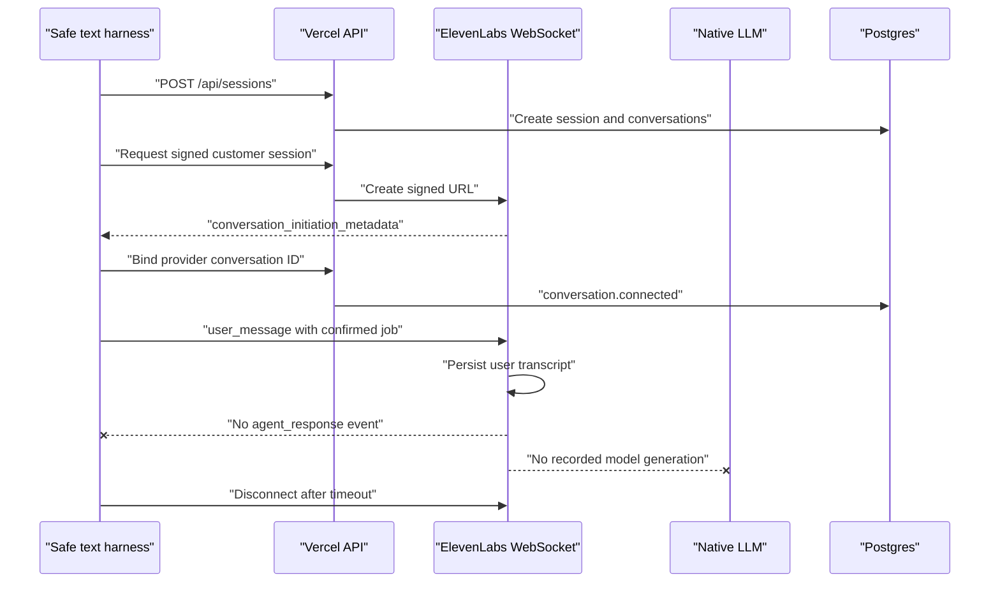
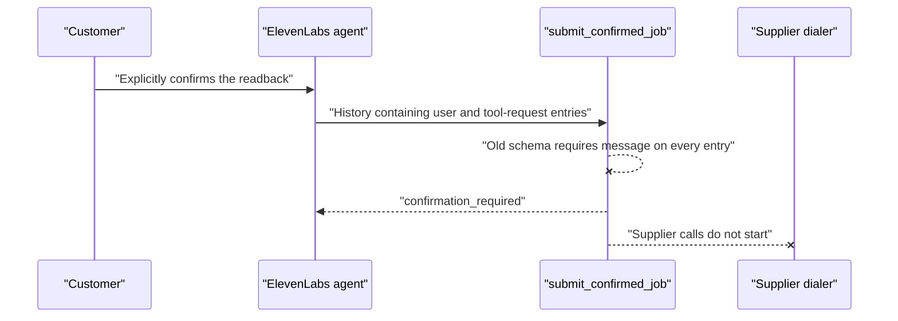

# Native chat produced no agent turn

## Observed production sequence

## Evidence

- Vercel and Postgres accepted the session and bound the customer conversation.
- ElevenLabs conversation `conv_9601kxwtnajhfq4ap94s5x0prc4v` completed with `text_only: true`, a 91-second duration, the full user transcript, no provider error, no agent transcript, no tool calls, and zero LLM usage.
- The live agent readback contained only `agent_tool_request` and `agent_tool_response_full_payload` in `conversation_config.conversation.client_events`.
- ElevenLabs' current Chat Mode documentation states that `agent_response` must be activated for text responses to be sent to the client.

## Root cause and fix

The provisioning script replaced the client-event allowlist with tool-only events. That made the text harness blind to normal agent turns and violated the provider's chat-mode contract. Both agents now enable user transcripts, complete/corrected agent responses, streaming text parts, response completion, and tool lifecycle events.

Native signed-session payloads also omit `custom_llm_extra_body` completely instead of sending an empty object. This keeps the initialization contract unambiguous and preserves the Custom LLM payload only on the rollback runtime.

## Verification gate

Reapply the text-only preview agents, confirm provider readback includes `agent_response`, redeploy the signed-session payload fix, and rerun the full production safe E2E before enabling voice or outbound calls.

## Follow-on: provider history parsing

Once response events were enabled, the agent reached `submit_confirmed_job`, but the tool returned `confirmation_required` after a real explicit confirmation.

The ElevenLabs provider record proved that tool-request and tool-result entries legitimately omit `message`. The parsers for job confirmation, customer selection, and supplier commitment now tolerate heterogeneous history entries and select the latest entry that actually has `role: user` plus a non-empty string message.

## Follow-on: silent native outbound call

The first real Twilio call was accepted and transcribed two customer utterances, but produced zero agent turns, zero LLM generations, zero TTS characters, and zero response-audio seconds.

Two native/voice initialization defects were present and are fixed together:

1. `executeOutboundCall` still generated a Custom LLM brain token and sent a non-empty `custom_llm_extra_body` to the native agent. Native outbound calls now omit every Custom LLM authority field and send only allowed dynamic variables.
2. The explicit client-event allowlist omitted `audio`. Voice agents now include `audio` and `interruption` alongside transcript, response, streaming, completion, and tool events.

The Twilio call record proves that the imported phone number and per-call Pacta agent ID were accepted. The phone number's dashboard-assigned agent is therefore not the outbound routing blocker; the outbound API chooses an explicit `agent_id` for each call.
