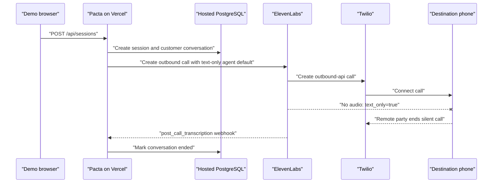

# Production outbound calls connected without audio

Date: 2026-07-19 14:08-14:10 UTC

## Observed execution

## Primary evidence

Two production requests returned HTTP 201 and created customer-call actions. Pacta stored an ElevenLabs conversation ID and Twilio Call SID for each.

| Call | Twilio interval (UTC) | Twilio result | ElevenLabs result |
| --- | --- | --- | --- |
| First | 14:08:58-14:09:18 | `completed`, outbound API, 20 seconds | `text_only=true`, zero input audio, zero output audio, zero TTS characters |
| Second | 14:09:42-14:09:59 | `completed`, outbound API, 17 seconds | `text_only=true`, zero input audio, zero output audio, zero TTS characters |

Both ElevenLabs transcripts contain only the configured first message as text. Both report `has_user_audio=false`, `has_response_audio=false`, and `Call ended by remote party`. The production agent readback has a TTS voice but defaults to `conversation.text_only=true`; its security settings permit overriding `conversation.text_only`.

## Edge status

| Edge | Status |
| --- | --- |
| Browser -> Pacta session route | Verified |
| Pacta -> hosted database | Verified |
| Pacta -> ElevenLabs outbound API | Verified |
| ElevenLabs -> Twilio | Verified |
| Twilio -> destination connection | Verified |
| ElevenLabs TTS -> phone audio | Failed |
| Phone microphone -> ElevenLabs ASR | Unknown because the call was text-only |
| ElevenLabs model response after user speech | Not attempted |

The visible failure was a silent connected call. The earliest causal fault was starting a telephone conversation with the agent's text-only default and no per-call voice override.

## Falsifiable hypotheses

1. **The text-only setting suppressed all call audio.** Confirmed by both provider records and the exact agent configuration.
2. **Twilio failed to connect the calls.** Disproved: both primary Call resources are `completed` with nonzero durations.
3. **The configured TTS voice was missing.** Disproved: provider agent readback includes a TTS voice and model.
4. **Pacta's model or webhook failed before speech.** Disproved as the earliest fault: neither was invoked because text-only mode produced no audio turn.

## Fix and repeated production trace

Outbound initiation now explicitly sends `conversation_config_override.conversation.text_only=false`. Browser chat remains text-only, and the provider agent default is unchanged. Regression coverage asserts voice mode for both native-tool and Custom LLM outbound calls while preserving the native authority-field boundary.

Commit `634053c` was deployed to production and readiness remained healthy and armed. One bounded verification call was then placed to the latest demo destination:

- Pacta session `9d781191-aa35-416d-850d-ae11845faad0` and ElevenLabs conversation `conv_2801kxxbt8w9faat8t72war0psf0` were created successfully.
- ElevenLabs reported `text_only=false`, 3.905 seconds of TTS output, 71 TTS characters, no provider error, and the configured first message in the transcript.
- Twilio reported `completed`, `outbound-api`, and a four-second connection from 14:17:43 to 14:17:47 UTC.
- The destination user explicitly confirmed hearing Pacta. This verifies the repaired TTS-to-phone edge.
- The call ended before user speech was captured, so microphone audio, ASR, and a subsequent model response remain unverified rather than assumed working.
