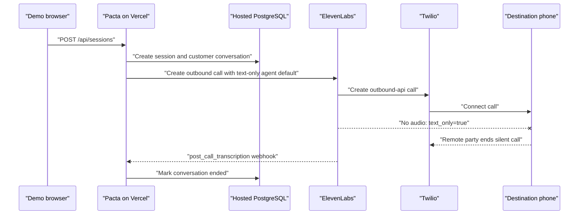

# Production outbound calls connected without audio

Date: 2026-07-19 14:08-14:10 UTC

## Observed execution



## Primary evidence

Two production requests returned HTTP 201 and created customer-call actions. Pacta stored an ElevenLabs conversation ID and Twilio Call SID for each.

| Call   | Twilio interval (UTC) | Twilio result                         | ElevenLabs result                                                          |
| ------ | --------------------- | ------------------------------------- | -------------------------------------------------------------------------- |
| First  | 14:08:58-14:09:18     | `completed`, outbound API, 20 seconds | `text_only=true`, zero input audio, zero output audio, zero TTS characters |
| Second | 14:09:42-14:09:59     | `completed`, outbound API, 17 seconds | `text_only=true`, zero input audio, zero output audio, zero TTS characters |

Both ElevenLabs transcripts contain only the configured first message as text. Both report `has_user_audio=false`, `has_response_audio=false`, and `Call ended by remote party`. The production agent readback has a TTS voice but defaults to `conversation.text_only=true`; its security settings permit overriding `conversation.text_only`.

## Edge status

| Edge                                        | Status                                 |
| ------------------------------------------- | -------------------------------------- |
| Browser -> Pacta session route              | Verified                               |
| Pacta -> hosted database                    | Verified                               |
| Pacta -> ElevenLabs outbound API            | Verified                               |
| ElevenLabs -> Twilio                        | Verified                               |
| Twilio -> destination connection            | Verified                               |
| ElevenLabs TTS -> phone audio               | Failed                                 |
| Phone microphone -> ElevenLabs ASR          | Unknown because the call was text-only |
| ElevenLabs model response after user speech | Not attempted                          |

The visible failure was a silent connected call. The earliest causal fault was starting a telephone conversation with the agent's text-only default and no per-call voice override.

## Falsifiable hypotheses

1. **The text-only setting suppressed all call audio.** Confirmed by both provider records and the exact agent configuration.
2. **Twilio failed to connect the calls.** Disproved: both primary Call resources are `completed` with nonzero durations.
3. **The configured TTS voice was missing.** Disproved: provider agent readback includes a TTS voice and model.
4. **Pacta's model or webhook failed before speech.** Disproved as the earliest fault: neither was invoked because text-only mode produced no audio turn.

## Fix and repeated production trace

Outbound initiation now explicitly sends `conversation_config_override.conversation.text_only=false`. Browser chat remains text-only, and the provider agent default is unchanged. Regression coverage asserts voice mode for both native-tool and Custom LLM outbound calls while preserving the native authority-field boundary.

Commit `634053c` was deployed to production and readiness remained healthy and armed. One bounded verification call was then placed to the latest demo destination:

- Pacta session `9d781191-aa35-416d-850d-ae11845faad0` and ElevenLabs conversation `conv_2801kxxbt8w9faat8t72war0psf0` were created successfully.
- ElevenLabs reported `text_only=false`, 3.905 seconds of TTS output, 71 TTS characters, no provider error, and the configured first message in the transcript.
- Twilio reported `completed`, `outbound-api`, and a four-second connection from 14:17:43 to 14:17:47 UTC.
- The destination user explicitly confirmed hearing Pacta. This verifies the repaired TTS-to-phone edge.
- The call ended before user speech was captured, so microphone audio, ASR, and a subsequent model response remain unverified rather than assumed working.

## Follow-up: audible greeting but no response

Date: 2026-07-20 20:03 UTC

The one-field outbound override restored the greeting, but two later production calls still captured no microphone audio: ElevenLabs reported no ASR model, zero transcription calls, zero input seconds, and no user turns. This narrowed the remaining failure to the phone-to-ASR edge.

### Causal timeline

- Before 2026-07-19 12:30 UTC, calls on the same customer agent contained user transcripts, ASR usage, model generation, and response TTS.
- The shared preview agent was updated at 12:30:28 UTC by the safe text provisioning flow. Its readback had `text_only=true`, text-chat turn settings, and PCM 16 kHz audio formats.
- Safe text E2E started two minutes later and reused that same agent. This establishes provider mutation, rather than commit `0819046`, as the relevant state change.
- Commit `0819046` only removed prefilled phone numbers from the UI. It did not change agent, media, Twilio, or ASR configuration.
- Commit `634053c` overrode only `text_only=false` per call. That restored TTS but left the shared agent's non-telephone media configuration in place.

### Full-duplex boundary trace

```mermaid
sequenceDiagram
    participant P as "Pacta on Vercel"
    participant E as "ElevenLabs agent"
    participant T as "Twilio Media Stream"
    participant H as "Destination phone"

    P->>E: "Outbound call; force text_only=false"
    E->>T: "TTS audio (previously PCM 16 kHz)"
    T->>H: "Greeting audible"
    H->>T: "Caller speech (Twilio μ-law 8 kHz)"
    T--xE: "No ASR input recorded"
    Note over E: "No ASR model, calls, input seconds, or user turn"
    E--xH: "No model response"

    P->>E: "Provision voice-native defaults"
    Note over E,T: "Inbound and outbound explicitly ulaw_8000"
    E->>T: "Greeting in μ-law 8 kHz"
    T->>H: "Greeting audible"
    H->>T: "Caller speech in μ-law 8 kHz"
    T->>E: "Verified: 11.544 input seconds"
    E->>E: "Verified: Scribe transcript + Gemini generation"
    E->>T: "Verified: 24.474 response seconds"
    T->>H: "Agent responds"
```

The visible failure was an agent that appeared to ignore the caller. The earliest causal fault was reusing the production voice agents as mutable text-test resources. The immediate protocol mismatch was that Twilio's telephone stream is μ-law at 8 kHz while the overwritten agent readback specified PCM at 16 kHz. The outbound `text_only=false` override could not repair that agent-level ASR/TTS configuration.

### Durable fix

The native provisioner now requires an explicit `--voice` or `--text` channel. Voice provisioning installs voice-native conversation defaults and explicitly configures both `asr.user_input_audio_format` and `tts.agent_output_audio_format` as `ulaw_8000`. A regression test asserts both halves of that contract. This makes an ambiguous provisioning invocation fail closed instead of silently resetting the shared voice agents to text defaults.

Provider readback after applying `--voice` showed both preview agents tagged `voice-enabled`, `conversation.text_only=false`, ASR provider `scribe_realtime`, and μ-law/8 kHz in both directions.

### Repeated production verification

One bounded consenting call created Pacta session `19c5112d-8021-44b8-8fbb-b4963d4c9e29` and ElevenLabs conversation `conv_9301ky0j0d7een6se8gf7tjnmy5b` at 2026-07-20 20:03:25 UTC.

- ElevenLabs completed the 34-second call with no error or warning.
- ASR used `scribe_realtime`, made 64 transcription calls, and received 11.544 seconds of audio.
- The transcript contains three caller turns and subsequent agent replies.
- Gemini 3.1 Flash Lite consumed the caller turns and generated responses.
- ElevenLabs returned 24.474 seconds / 529 characters of TTS, well beyond the initial greeting.
- The destination user independently confirmed that the interaction worked.

Every edge from phone microphone through Twilio, ElevenLabs ASR, model generation, TTS, and back to the phone is therefore verified. The remaining architectural risk is that an explicitly requested `--text --apply` still mutates these shared preview IDs; the required channel flag prevents the accidental invocation that caused this incident, but complete resource isolation would require separate text-test agent IDs.
