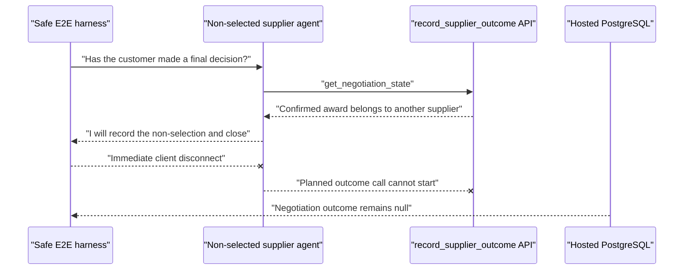

# Safe E2E supplier clarification timeout

Date: 2026-07-19 14:32-14:34 Europe/Zurich (12:32-12:34 UTC)

Scope: production text-only ElevenLabs preview agents with outbound calls explicitly disarmed. No PSTN API was invoked.

## Observed sequence

```mermaid
sequenceDiagram
    participant H as "Safe E2E harness"
    participant E as "ElevenLabs supplier agent"
    participant A as "Pacta tool API"
    participant D as "Hosted PostgreSQL"

    H->>E: "My all-in price is 1,490 Swiss francs"
    E->>A: "get_negotiation_state"
    A->>D: "Load confirmed job and negotiation"
    D-->>A: "Confirmed Zurich-Munich job"
    A-->>E: "Verified state and next action"
    E-->>H: "Does all-in include fuel, tolls, and accessorials?"
    H--xE: "No clarification response"
    H->>D: "Poll for three comparable offers"
    D-->>H: "Two comparable; Northstar remains draft"
    H--xH: "Timeout after 90 seconds"
```

## Edge evidence

| Edge                                  | Status                | Primary evidence                                                                                             |
| ------------------------------------- | --------------------- | ------------------------------------------------------------------------------------------------------------ |
| Harness -> ElevenLabs user turn       | Verified              | Provider transcript `conv_4201kxx5tvfdes5v4658mtt99p9b`, time 0 seconds                                      |
| ElevenLabs -> `get_negotiation_state` | Verified              | Provider tool request and successful result at 1-2 seconds                                                   |
| Tool API -> hosted database           | Verified              | Result returned the exact confirmed job and negotiation ID                                                   |
| ElevenLabs -> harness clarification   | Verified              | Provider transcript contains the clarification at 2 seconds                                                  |
| Harness -> clarification reply        | Failed                | The harness had no branch for a draft offer after the first supplier turn                                    |
| ElevenLabs -> `submit_offer`          | Not attempted         | Provider transcript has no call; hosted `tool_invocations` has calls only for Rhine Cargo and Alpine Haulage |
| `submit_offer` -> database            | Unknown for Northstar | No request crossed this boundary, so validation and persistence were not involved                            |
| Harness -> terminal state             | Failed visibly        | Production view remained `negotiating` until the 90-second timeout                                           |

The visible failure was the final state timeout. The earliest causal fault was the test harness ending its simulated supplier behavior after a legitimate clarification question.

## Ranked falsifiable hypotheses

1. **Harness does not answer a valid clarification (confirmed).** The exact provider transcript ends with the agent's clarification and contains no later user turn.
2. **`submit_offer` rejected Northstar's document (disproved).** Neither provider nor database evidence contains a Northstar `submit_offer` attempt.
3. **State lookup failed before offer collection (disproved).** The provider captured a successful state result containing the exact session negotiation.
4. **Chat response delivery failed (disproved).** The harness logged the same clarification present in the finalized provider transcript.

## Smallest supported fix

After the first supplier turn, read authoritative session state. For only those suppliers whose offer is still draft, answer one explicit clarification that states the total and inclusions, then continue the existing comparable-offer gate. This preserves the agent's honesty rule and server-side validation while making the simulated counterparty genuinely multi-turn.

The regression gate is the same full production safe E2E trace. It must now reach three comparable offers, exact customer selection, selected-supplier commitment, completed session state, and successful native tool-call assertions while readiness remains `disarmed`.

## Remaining uncertainty

Agent behavior is probabilistic even at temperature zero. One clarification branch covers the observed behavior without masking repeated indecision: if the explicit clarification still does not produce an offer, the existing timeout remains a hard failure. Voice mode and real outbound calling remain unverified and disarmed.

## Follow-on: closeout disconnect race

The first successful rerun reached a confirmed award and completed session, but the post-run database trace showed only Northstar Transit had `not_selected_notified`; Alpine Haulage still had no outcome. The client trace showed Alpine first announced that it would record the outcome, while the harness disconnected all conversations as soon as that agent message arrived.



The earliest fault was another harness assumption: receipt of an agent sentence was treated as completion of the full agent turn. The product endpoint was not reached, so neither provider delivery nor persistence failed. The harness now waits for both non-selected negotiations to reach authoritative `not_selected_notified` state before disconnecting, and its native tool gate requires one successful `record_supplier_outcome` call for each non-selected supplier.

## Final verification

At 2026-07-19 14:39-14:40 Europe/Zurich, production safe session `6bbf4031-c990-457d-8061-8aba4cb50bb9` passed with outbound calls `disarmed`:

- Northstar Transit exercised the clarification branch and then stored a comparable CHF 1,490 offer.
- Rhine Cargo's CHF 1,460 offer was selected and reached `selected_confirmed` only after `commit_selected_offer` succeeded.
- Alpine Haulage and Northstar Transit each completed one successful `record_supplier_outcome` call before disconnect; hosted database readback shows both `closed / not_selected_notified`.
- The session reached `completed` with a confirmed award and no blocked or errored provider tool response.
